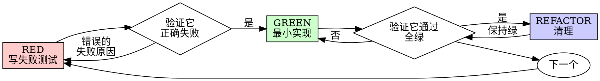

# 测试驱动开发（TDD）

## 概述

先写测试，看它失败，再写最小实现让它通过。

**核心原则**：如果你没亲眼看到测试失败，就不知道它在测对的东西。

**违背规则的字面，就是违背规则的精神。**

## 与 `gherkin-authoring` skill 的分工

仓库里同时存在两个 BDD 相关 skill，分工不重叠：

| Skill | 层次 | 产物 | 视角 |
| --- | --- | --- | --- |
| `gherkin-authoring` | 规格 / 接受标准 | `.feature` 文件、Cucumber 场景、嵌入 markdown 的 Gherkin 块 | 外部、业务/用户视角 |
| 本 skill（`test-driven-development`） | 实现 / 单元测试 | 测试函数代码里的 `// Given: // When: // Then:` 中文注释 | 内部、开发者视角 |

业务规格用 Gherkin 关键字（`Given/When/Then` 步骤行），单元测试用 GWT 中文注释（先注释、后代码）。**两者绝不混用**：不要把 .feature 文件当单测写，也不要把 GWT 三段写成 Gherkin 步骤行。

## 何时使用

**始终使用**：
- 新功能
- Bug 修复
- 重构
- 行为变更

**例外（必须先与人类伙伴确认）**：
- 一次性原型
- 自动生成的代码
- 配置文件

心里冒出"就这次跳过 TDD"？停。那是合理化，不是判断。

## 铁律

```
没有先失败的测试，就没有生产代码
```

代码先于测试写出来了？删掉。重来。

**没有例外**：
- 不要"留着当参考"
- 不要"边写测试边对照微调"
- 不要再看它
- 删，就是删

按测试重新实现。就这条。

## 红→绿→重构循环



### RED — 先写 Given/When/Then 注释，再写失败断言

每写一个单元测试，**测试函数体内的第一行必须是 `# Given:`（或 `// Given:`）**，紧接着 `When:` 与 `Then:` 三段中文注释，把意图讲清；之后才允许写赋值、Mock、被测调用、断言。

**6 条强约束**（违反任一条，测试无效，重写）：

1. **三段注释先于任何代码**。在赋值、Mock、断言之前必须出现 `Given/When/Then` 三段。不允许"先写代码再补注释"。
2. **Given 必须列举具体值或具体行为**。禁止"初始化对象""模拟用户""准备数据"这类泛词。要写出 `Given: 数据库返回 id=42、name="Alice" 的用户`，而不是 `Given: 准备用户数据`。
3. **When 块只能触发一个被测动作**。一个测试函数里 When 段只能调用**一次**被测函数。两次以上说明用例职责不单一，必须拆。
4. **Then 注释与断言一一对应**。Then 注释里列举的每条可观察结果，下方必须有一条断言；反之断言数量不能超过 Then 注释里点出的结果数。
5. **不允许在一个函数里串联多个 GWT 块**。多场景（GWT1 → 状态变化 → GWT2）要拆成多个测试函数，命名为 `test_xxx_scenario_a` / `test_xxx_scenario_b`。
6. **Given 段结束后、When 前不允许追加 setup**。所有前置准备都归 Given；当前 When 触发前的世界状态必须已经在 Given 里完整描述。

<Good>
```python
def test_save_user_succeeds_when_name_is_valid():
    # Given: 用户对象 name="Bob"、email="bob@example.com"，数据库的 insert 会返回 Success
    user = User(name="Bob", email="bob@example.com")
    mock_db = MockDatabase(insert_result=Success())

    # When: 调用 user.save_to_db 持久化
    result = user.save_to_db(mock_db)

    # Then: 返回 Success 实例，且 insert 仅被调用一次
    assert isinstance(result, Success)
    assert mock_db.insert_called_once()
```
注释具体、动作单一、断言与 Then 一一对应。
</Good>

<Bad>
```python
def test_user_flow():
    # Given: 初始化数据
    user = create_user()

    # When: 执行操作
    result1 = user.set_name("Bob")
    result2 = user.save_to_db()

    # Then: 验证
    assert result2.success
```
Given 太泛、When 两个动作、Then 注释与断言对不上。重写。
</Bad>

写完三段注释 + 断言后再去看断言怎么对接被测代码的接口（你**还没写实现**）——这是把测试当设计文档用，强制你想清楚被测函数的签名长什么样。

<Good>
```typescript
test('retries failed operations 3 times', async () => {
  // Given: 一个会前两次抛错、第三次返回 "success" 的操作
  let attempts = 0;
  const operation = () => {
    attempts++;
    if (attempts < 3) throw new Error('fail');
    return 'success';
  };

  // When: 用 retryOperation 包裹这个操作并 await
  const result = await retryOperation(operation);

  // Then: 最终拿到 "success"，且总共尝试 3 次
  expect(result).toBe('success');
  expect(attempts).toBe(3);
});
```
名称清晰、测真行为、三段注释先于代码。
</Good>

<Bad>
```typescript
test('retry works', async () => {
  const mock = jest.fn()
    .mockRejectedValueOnce(new Error())
    .mockRejectedValueOnce(new Error())
    .mockResolvedValueOnce('success');
  await retryOperation(mock);
  expect(mock).toHaveBeenCalledTimes(3);
});
```
名称含糊、测的是 mock 而不是代码、没有 GWT 注释。
</Bad>

**单测必须满足**：
- 一个行为
- 清晰的名字
- 先于代码的 GWT 三段注释
- 真实代码（不到必须时不引入 mock）

### 验证 RED — 亲眼看它失败

**强制。绝对不可跳过。**

```bash
# 任选一种，取决于栈
npm test path/to/test.test.ts
pytest path/to/test_xxx.py::test_save_user_succeeds_when_name_is_valid -x
go test ./pkg/xxx -run TestSaveUser_Succeeds
```

确认：
- 测试**失败**（不是报错）
- 失败信息符合预期
- 失败是因为**功能尚未实现**（不是拼写错误、不是 import 缺失）

**测试通过了？** 你在测的是已经存在的行为。修测试。

**测试报错了？** 修错误，再跑，直到它以正确的姿势失败。

### GREEN — 最小实现

写能让测试通过的**最简**代码。

<Good>
```typescript
async function retryOperation<T>(fn: () => Promise<T>): Promise<T> {
  for (let i = 0; i < 3; i++) {
    try {
      return await fn();
    } catch (e) {
      if (i === 2) throw e;
    }
  }
  throw new Error('unreachable');
}
```
刚够通过测试。
</Good>

<Bad>
```typescript
async function retryOperation<T>(
  fn: () => Promise<T>,
  options?: {
    maxRetries?: number;
    backoff?: 'linear' | 'exponential';
    onRetry?: (attempt: number) => void;
  }
): Promise<T> {
  // YAGNI
}
```
过度设计。
</Bad>

不要加测试没要求的功能、不要顺手重构邻近代码、不要"改进"超出测试范围的东西。

### 验证 GREEN — 亲眼看它通过

**强制。**

```bash
npm test path/to/test.test.ts
```

确认：
- 这个测试通过
- 其他测试也都还通过
- 输出干净（没有 warning、没有 error 日志）

**测试还失败？** 修代码，**不要改测试**。

**别的测试挂了？** 立刻修，不要往后拖。

### REFACTOR — 清理

**仅在绿之后**做：
- 消除重复
- 改进命名
- 抽取辅助函数

保持测试绿。不要在重构里追加新行为。

**禁止改 GWT 注释来掩盖设计缺陷**。注释是设计文档，代码是实现；注释不该为代码让步，反过来才对。

### 重复

下一个失败测试，开始下一个功能。

## 好测试的特征

| 特征 | 好 | 坏 |
| --- | --- | --- |
| **最小** | 只测一件事。名字里有 "and"？拆。 | `test('validates email and domain and whitespace')` |
| **清晰** | 名字描述行为 | `test('test1')` |
| **暴露意图** | 演示你想要的 API 长什么样 | 把代码该做什么藏起来 |

## 为什么顺序重要

**"我写完代码再补测试也能验证它工作"**

后写的测试一上来就通过。立刻通过证明不了什么：
- 可能测的是错的东西
- 可能在测实现，而不是行为
- 可能漏了你没想到的边界
- 你从没看见它真的捕获过 bug

测试先于代码，强迫你看到失败——这才证明它真的在测点东西。

**"我已经手工测过所有边界了"**

手工测试是临时的。你以为都测过了，但：
- 没有记录测过哪些
- 改代码后无法重跑
- 压力下容易漏
- "我试的时候它能用" ≠ 全面覆盖

自动化测试是系统的。每次都以同样的方式跑。

**"删掉 X 小时的工作太浪费了"**

沉没成本谬误。时间已经花掉了。你现在的选择是：
- 删了用 TDD 重写（再 X 小时，高置信度）
- 留着事后补测试（30 分钟，低置信度，大概率有 bug）

"浪费"的是留着一份你不能信任的代码。没有真测试的能跑的代码 = 技术债。

**"TDD 教条主义，务实就是要灵活"**

TDD 本身就是务实的：
- 在提交前就发现 bug（比事后调试快）
- 防止回归（测试一断你立刻知道）
- 文档化行为（测试就是怎么用代码的示范）
- 让重构安全（随便改，测试会兜底）

"务实"地走捷径 = 在生产环境调试 = 更慢。

**"事后补测试也能达成同样目标——重精神不重仪式"**

不行。事后测试回答的是"这玩意做什么"，先于代码的测试回答的是"这玩意**应该**做什么"。

事后测试会被你的实现带偏。你测的是你写出来的东西，不是需求要的东西。你只验证你**记得**的边界，不是设计阶段**发现**的边界。

先于代码的测试强迫你在实现前发现边界。事后测试验证你记没记全（你没记全）。

事后花 30 分钟补测试 ≠ TDD。你拿到了覆盖率，丢掉了"测试真的在测点东西"的证据。

## 常见合理化

| 借口 | 现实 |
| --- | --- |
| "太简单，不值得测" | 简单代码也会坏。测一下 30 秒。 |
| "我先实现，回头补测试" | 立刻通过的测试什么也证明不了。 |
| "事后补也能达成同样目标" | 事后 = "这做什么"；先于代码 = "这应该做什么"。 |
| "我已经手工测过了" | 临时 ≠ 系统。没记录，无法重跑。 |
| "删 X 小时工作太浪费" | 沉没成本。留着不可信的代码才是技术债。 |
| "留着当参考，再先写测试" | 你会偷看然后微调。那就是事后测试。删，是删。 |
| "我得先探索一下" | 可以。探索完丢掉，重新从 TDD 起步。 |
| "测试太难写 = 设计模糊" | 听测试的。难测 = 难用。 |
| "TDD 会拖慢我" | TDD 比调试快。务实 = 测试先行。 |
| "手工更快" | 手工证明不了边界覆盖。每次改代码你还得再测一遍。 |
| "已有代码没测试" | 你在改进它。给已有代码补测试。 |

## 红旗清单 — 立刻停下、重新开始

- 代码先于测试
- 实现完了再补测试
- 测试一写完就通过
- 说不清测试为什么失败
- 测试留到"以后再加"
- 在合理化"就这一次"
- "我已经手工测过了"
- "事后补测试能达成同样目标"
- "重精神不重仪式"
- "留着当参考"或"对照着写"
- "已经花了 X 小时，删掉太浪费"
- "TDD 教条，我在务实"
- "这次情况不一样，因为……"

**以上任意一条 = 删代码，按 TDD 重来。**

## 例子：Bug 修复

**Bug：** 空 email 被接受

**RED**
```typescript
test('rejects empty email', async () => {
  // Given: 提交表单时 email 字段为空串
  const payload = { email: '' };

  // When: 调用 submitForm
  const result = await submitForm(payload);

  // Then: 返回错误信息 "Email required"
  expect(result.error).toBe('Email required');
});
```

**验证 RED**
```bash
$ npm test
FAIL: expected 'Email required', got undefined
```

**GREEN**
```typescript
function submitForm(data: FormData) {
  if (!data.email?.trim()) {
    return { error: 'Email required' };
  }
  // ...
}
```

**验证 GREEN**
```bash
$ npm test
PASS
```

**REFACTOR**
如果还要校验多个字段，把校验抽成单独的 helper。

## 验收 checklist

声明任务完成前：

- [ ] 每个新函数 / 方法都有测试
- [ ] 每个测试在实现之前都亲眼看到过它失败
- [ ] 每个测试都是因为预期原因失败（功能缺失），不是拼写或环境
- [ ] 每个测试函数体的第一行是 `Given:`，含完整 GWT 三段中文注释
- [ ] 三段注释具体（无"初始化对象""执行操作"这类泛词）
- [ ] 每个测试只触发一个被测动作（When 只调一次被测函数）
- [ ] Then 注释里点出的可观察结果与断言数量一致
- [ ] 写的是让测试通过的最小代码
- [ ] 所有测试通过
- [ ] 输出干净（无 warning、无 error 日志）
- [ ] 测试跑的是真实代码（mock 仅在不可避免时引入）
- [ ] 边界条件和错误路径被覆盖

打不齐这些勾？你跳过了 TDD。重来。

## 卡住时

| 问题 | 解法 |
| --- | --- |
| 不知道怎么测 | 先把你**希望**这个 API 长什么样写出来，先写断言。还不行就问人类伙伴。 |
| 测试太复杂 | 设计太复杂。简化接口。 |
| 必须 mock 一切 | 代码耦合太重。用依赖注入。 |
| setup 巨大 | 抽 helper。还是复杂？简化设计。 |

## 与调试的集成

发现 bug？先写一个能复现它的失败测试。走 TDD 循环。这个测试既证明修复有效，也防止回归。

**永远不要不写测试就修 bug。**

## 测试反模式

引入 mock 或测试辅助代码时，必读 @testing-anti-patterns.md，避免常见陷阱：
- 测的是 mock 行为而不是真实行为
- 在生产类里加只为测试存在的方法
- 没搞懂依赖就 mock

## 终极规则

```
生产代码 → 必须有一个先前失败过的测试
否则 → 不算 TDD
```

没有人类伙伴的明确许可，没有例外。
