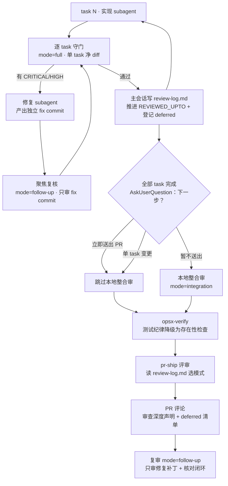
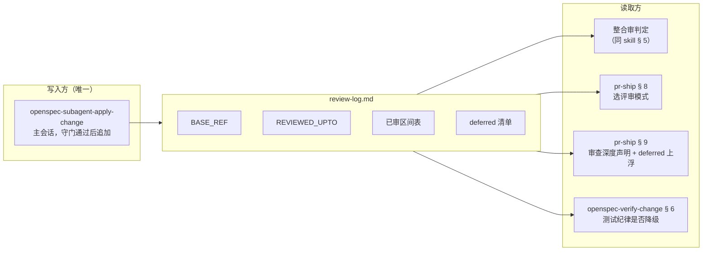

## Context

本库的 code review 守门分散在三个 skill / command 里，各自独立演进，从未有人把它们放在一张表上对范围：

| 触发点 | 定义位置 | diff 范围 | 发生性 |
| --- | --- | --- | --- |
| R1 逐 task 守门 | `openspec-subagent-apply-change` § 4b | 单 task 净 diff | 每 task 必发 |
| R2 回灌复审 | 同上 § 4c | 重审整个 task，最多 3 轮 | 有阻断才发 |
| R3 full review | 同上 § 5 | 本 change 累计 diff | 默认必发 |
| R4 verify 测试纪律 | `openspec-verify-change` § 6 | 全部生产文件 + 测试抽样 | 必发 |
| R5 PR 评审 | `pr-ship` § 8 | PR ↔ target 全量 diff | 必发 |
| R6 PR 复审 | `pr-ship` § 12 → 回 § 8 | 再次 PR 全量 diff | 用户选才发 |

对上范围后结论是：`R1 ⊂ R3 ≈ R5`，`R6 ≈ R5`，而 R4 的测试纪律 checklist 与 R1/R3/R5 的「测试纪律」维度逐条重叠。同一份实现代码的**必发全量 review 次数 = 3**，TDD 维度**触及 4 次**。

约束：

- `code-reviewer` 的分级 rubric、finding 格式、只读纪律是本库的资产，**本 change 不动它们**——要改的是「喂给它什么范围」和「允许它报什么」。
- 串行（轻量）模式与 `/opsx-bulk-apply` 的现有行为必须保持不变（那两条路径本来就没有逐 task 守门，不存在重复问题）。
- 本库自身没有可执行的生产代码，全部产物是指令文案；验证手段只能是结构检查与文本核对，不是单元测试。

## Goals / Non-Goals

**Goals**

- 同一份代码的必发全量 review 从 3 次降到 1 次（逐 task 守门）+ 1 次整合审。
- TDD 纪律维度触及从 4 次降到 2 次。
- 复审只审增量，不重扫已审范围。
- 守门期间未阻断的 MEDIUM/LOW 能上浮到人类 reviewer（今天会丢）。
- 无水位线时行为与今天完全一致（向后兼容）。

**Non-Goals**

- **不改 `code-reviewer` 的分级标准与 finding 格式**——它们工作良好，问题不在这里。
- **不削弱逐 task 守门**——CRITICAL/HIGH 阻断 checkbox 的机制原样保留，它是唯一一道「代码写出来的当下」就生效的门。
- **不追求把 review 次数压到 1**——整合审看的是逐 task 结构上看不到的东西（跨 task 交互），是不同视角而非重复。
- **不引入外部依赖或新工具**——水位线是一份 markdown，靠既有的 Read/Write/Bash 维护。
- **不替代人类 reviewer**——所有改动只影响 AI 自审的编排。

## Decisions

### D1 · 水位线载体 = change 目录下的 markdown

`openspec/changes/<change>/review-log.md`。

- **备选 A：`.review-state.json`** — 机器解析更稳，但人类不读，审计价值低；而水位线的第二用途正是「让人看见 AI 审到什么程度」。
- **备选 B：不落盘，只在会话内传递** — 零文件污染，但换会话或单独跑 `/pr-ship` 时水位线丢失，退化回全量审，等于优化不成立。
- **选 markdown 的理由**：落在 `openspec/` 内 → `intent-gate.py` 天然豁免、随 change 一起归档、可进 PR 供人类查阅、AI 读写无需解析器。**已实测** `openspec validate --strict` / `status` / `list` 对 change 目录内的未知文件无反应（探针文件放入再移除，三条命令输出不变）。

### D2 · 整合审位置由一次明确问询决定，不由模型推断

R3 今天的跳过条件之一是「用户计划立即 `/pr-ship`」——这是要求模型读心。改为在收口前用 AskUserQuestion 明确问一次下一步，按答案硬判定：

| 用户选择 | 本地整合审 | PR 阶段整合审 |
| --- | --- | --- |
| 立即送出 PR | 跳过 | 执行（`integration` 模式） |
| 暂不送出 | 执行（只审跨 task 维度） | 后续若送出，按水位线走 `integration` |
| 单 task 变更 | 恒跳过 | 按水位线走 `integration` |

- **备选：保留本地 full review，`/pr-ship` 转为纯增量** — apply 收口就有整体结论，但贴进 PR 的那份报告会变薄，人类 reviewer 拿到的信息更少。PR 是给人看的，报告厚度应该留在那一侧。
- **理由**：`/pr-ship` 本来就**必须**产出一份贴 PR 的报告，整合审搭在那里是零额外成本；本地 full review 则是纯增开销。

### D3 · 评审模式三分，写进 agent 定义

`code-reviewer` 增加 `full` / `integration` / `follow-up` 三种模式，各自写明「必须报」与「不得报」；派活 prompt 指明模式与已审范围。

配套一条新铁律：**不重复上报 prompt 已声明「已审范围 / 已处理 finding」内的问题**；但若确认某条上游 finding 实际没修好，仍可上报，须标注「上游 review 未闭环」——保留纠错能力，堵掉无脑重扫。

- **备选：只在 prompt 里叮嘱，不改 agent 定义** — prompt 是每次现写的，会漂移；agent 定义是单一权威处，三个调用点共享。本库既有设计（`pr-ship` § 8 明确写「不要在这里重抄一份 rubric」）已经确立了这个分工，沿用它。

### D4 · 修复统一新增 `fix:` commit，不再 `--amend`

今天 § 4c 允许修复 subagent 二选一（amend 或新增 commit）。amend 会改写 commit SHA，导致「修复增量」这个区间无法稳定圈定——而聚焦复核正依赖这个区间。

- **代价**：一个 task 可能对应多个 commit，破坏「一 task 一 commit」的整洁。
- **缓解**：commit 消息保持 `fix: <task 编号> <finding 摘要>` 可追溯；PR 阶段可 squash。整洁性让位于「区间可圈定」这一功能性需求。

### D5 · verify 的测试纪律检查降级而非删除

走过守门 → 只验「配对测试文件存在」+ 抽 1 例确认三段注释存在，并注明细节判定已由守门覆盖；无水位线 → 保持今天的完整抽查，一字不改。

- **理由**：完整删除会让串行模式失去唯一一道测试纪律检查；保留完整版又是第 4 次重复。按水位线分流是唯一同时成立的解。

### D6 · 无水位线 = 今天的行为

每一处水位线感知逻辑都以「读不到 review 记录」为默认分支，回退到现有行为。这让本 change 对串行模式、`/opsx-bulk-apply`、以及任何手工分支零影响。

### 守门编排 · 优化后的动态视图

### 状态流 · 谁写水位线、谁读水位线

**图的边界与假设**：两图都是 C4 dynamic 级的轻量视图（用户已审批方案，不再追加 context/container 级）。假设：水位线只有一个写入方（逐 task 守门的主会话），读取方均为只读；`code-reviewer` subagent 本身**不读**水位线文件，它拿到的是 prompt 里由主会话摘出的「已审范围 + 已处理 finding」——保持 reviewer 干净、不带本地状态。

## Risks / Trade-offs

- **[Risk] 水位线失真**（用户在守门之外手改代码，或跨会话续做）→ Mitigation：`/pr-ship` 的「部分覆盖」模式兜底——`REVIEWED_UPTO` 之后的任何提交一律走全量审，水位线的存在只能缩小已覆盖部分的范围，不能让未审代码蒙混过关。
- **[Risk] 整合审漏掉单 task 级问题**（逐 task 守门当时判错，整合审又被告知不重报）→ Mitigation：D3 的纠错口子——reviewer 可以报「上游 finding 未闭环」，只是需要显式标注，不是禁止发声。
- **[Risk] 少审一道降低质量** → 被砍掉的都是**同范围、同 rubric、同一个 agent** 的重复扫描，不是不同视角的交叉验证。真正的独立视角（人类 reviewer）不受影响，且本 change 还让 deferred finding 首次进入 PR。
- **[Trade-off] 一 task 一 commit 的整洁性**（D4）→ 换来修复增量区间可稳定圈定，PR 阶段可 squash 找回整洁。
- **[Trade-off] 多一次收口问询**（D2）→ 换来消灭一次全量 review，且把「模型读心」换成用户明示。

## Migration Plan

本 change 只改指令文案，无运行时状态、无数据迁移。

- **上线**：随模板分发。已装模板的下游项目跑一次 `install.sh` 更新即可。
- **进行中的 change**：没有 `review-log.md` 的 change 走 D6 的默认分支，行为与今天一致，不需要补建水位线。
- **回滚**：`git revert` 本 change 的提交即可，无残留状态。已生成的 `review-log.md` 会被后续流程忽略（CLI 已验证忽略未知文件），不影响归档。

## Open Questions

- **整合审是否需要一个独立的 agent 定义？** 目前复用 `code-reviewer` + 模式参数。若日后整合维度的判据显著长于单 task 判据，可考虑拆一个 `integration-reviewer`。本次不拆——判据还没长到需要拆的程度，过早拆分违反 YAGNI。
- **`review-log.md` 是否该纳入 `/opsx-archive` 的归档清单？** 它在 change 目录内，archive 移动整个目录时自然带走。是否要在归档后保留其内容供长期审计，留待第一次实际归档时观察。
- **本 change 自身用哪种 apply 模式？** 全部产物是指令文案、无生产代码，TDD 例外条款适用（`openspec-apply-change` § 7 明列「纯文档 / 纯配置类 task 可跳过，但必须明告用户」）。建议串行模式实施，验证靠 tasks 里逐条的结构检查——本 change 恰好是「不该用逐 task 守门」的典型例子。
