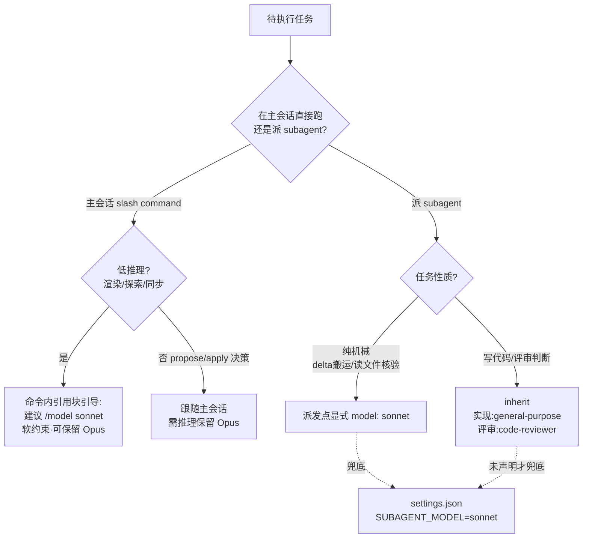

## Context

模板通过 `.claude/`（commands / skills / agents / hooks）+ `CLAUDE.md.snippet` 分发给下游项目。模型选择当前有三条隐式路径：

1. **主会话模型** — 用户当前 `/model` 选的层级；所有 slash command 在主会话跑，跟随该层级。
2. **subagent 模型** — 通过 Agent 工具派发；若派发点未声明 `model:`，则由环境变量 `CLAUDE_CODE_SUBAGENT_MODEL` 兜底，否则回落到默认（Opus）。
3. **agent 定义模型** — agent 文件 frontmatter 的 `model:`（如 `code-reviewer.md` 声明 `model: inherit`）。

现状问题：路径 2 的兜底只存在于维护者个人机器（`settings.json` 未进模板），路径 1 完全无引导（低推理命令跟随主会话跑 Opus），路由纪律没进 `CLAUDE.md.snippet`。三者叠加导致低推理任务系统性跑在 Opus 上。

约束：

- 模板服务不特定下游，任何改动必须对「下游不改配置」也成立。
- 不得剥夺用户「就想用 Opus 跑某活」的选择权 → 主会话侧只能引导不能强制。
- 遵循仓库「确定性配置压过软约束」原则：能用确定性配置（settings.json / 显式 model 参数）解决的走配置，主观判断留给引导。
- in-force ADR 集合为空（`openspec/adr/` 无文件），本设计不受既有决策约束。

## Goals / Non-Goals

**Goals:**

- 下游装模板即获得 subagent 默认 Sonnet 兜底，无需手动配置。
- 低推理命令 / skill 携带明确的主会话降级引导，且不锁死模型。
- 纯机械 subagent 派发点在派发指令中显式声明 Sonnet，意图自解释、兜底缺失时仍正确。
- 路由纪律随 `CLAUDE.md.snippet` 下发，下游获得一致约束。

**Non-Goals:**

- 不改变任何业务逻辑、hooks、intent-gate 门禁、openspec schema。
- 不对需推理的 subagent（实现类 / 评审类）降级 —— 它们保留 inherit。
- 不通过 frontmatter 对命令强制锁 `model:`（会剥夺用户选择权）。
- 不引入运行期模型自动切换机制（超出模板指令层能力，且不可靠）。

## Decisions

**决策 1：subagent 兜底用可分发的 `settings.json` env，而非在每个派发点写 model。**
- 为什么：一处配置覆盖所有未声明 model 的 subagent，下游零操作即生效；逐点写 model 会遗漏且维护成本高。
- 备选（否决）：在每个 Agent 工具调用点都写 `model: sonnet` —— 覆盖不全、易漏、与「实现类要 inherit」冲突。
- 与决策 3 的关系：兜底是「面」，决策 3 的显式声明是对纯机械点的「点」加固（双保险）。

**决策 2：主会话低推理命令用引用块软引导，不锁 frontmatter。**
- 为什么：命令跑在主会话，frontmatter 的 `model:` 会对所有下游强制生效，剥夺选择权，且与「确定性配置压过软约束、但软约束不该越权强制」冲突。引导把判断权留给用户，正是全局路由纪律「主会话自查」的落地。
- 备选（否决）：命令 frontmatter 写 `model: sonnet` 强制降级 —— 用户想用 Opus 深挖某次探索时被迫降级，损害体验。

**决策 3：纯机械 subagent 派发点显式标注 Sonnet；实现 / 评审类保留 inherit。**
- 为什么：archive 的 sync（delta 搬运）、standardize 的证据调查（读文件核验）是零推理机械活，显式声明让意图自解释，且在下游未加载兜底时仍正确降级。实现类要写代码、评审类要判断，需 Opus 级推理，保留 inherit。
- 判据来自路由纪律：搜索 / 读文件 / 机械同步 → Sonnet；写代码 / 难判断 → 可 Opus。

**决策 4：路由纪律精简版进 `CLAUDE.md.snippet`。**
- 为什么：snippet 是模板对下游 CLAUDE.md 的贡献入口；把三条核心纪律（默认 Sonnet / 仅复杂升 Opus / 主会话自查）下发，使下游行为与模板设计一致。
- 保持精简：只放可执行的三条，不照搬全局 CLAUDE.md 的完整路由段（避免 snippet 膨胀）。

### 任务 → 模型路由决策流

## Risks / Trade-offs

- [下游已自设 `CLAUDE_CODE_SUBAGENT_MODEL`] -> 用户 settings.local.json 优先级高于模板 settings.json，用户显式配置仍胜出，不冲突。
- [引导行是软约束，用户可能忽略仍跑 Opus] -> 可接受：这是设计意图（保留选择权）；成本可控，且 subagent 侧已有硬兜底。
- [settings.json 若已存在于下游] -> 本 change 是新建模板内 settings.json；下游合并时需注意不覆盖其既有 settings。安装文档 / snippet 应提示这是 env 段的最小集，可合并。
- [引用块引导增加命令文本长度] -> 每处仅 2–3 行，影响可忽略。

## Migration Plan

- 部署：纯文件新增 + 文本追加，无需迁移脚本。装模板的下游在下次同步模板时获得。
- 回滚：每项独立。删 `settings.json` 即回原状；引导行是独立引用块，可单独移除；显式 model 标注可撤回原样；snippet 段可删。
- 验证：settings.json 为合法 JSON 且含 env 键；4 处命令 / skill 含引导块；2 处派发点含 sonnet 标注；snippet 含路由段。

## Open Questions

- 无需 revisit 的 in-force ADR（当前为空）。
- 本 change 是否值得沉淀一条 ADR？倾向「是」——「模板分发的模型路由默认策略（subagent 兜底 + 主会话软引导，不锁 frontmatter）」是一条跨后续变更都应遵守的架构决策，适合由 adr 步记录，供以后新增命令 / subagent 时对齐。
