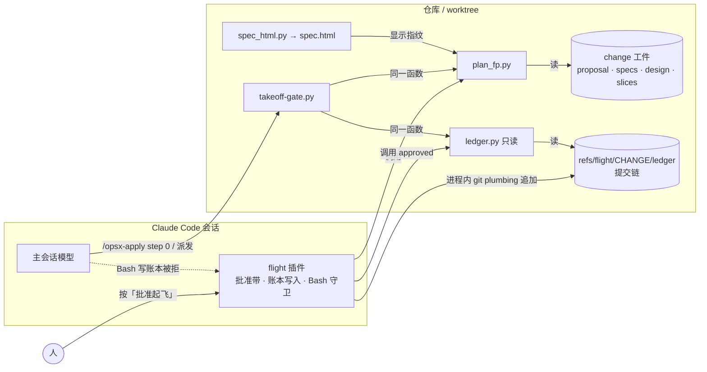
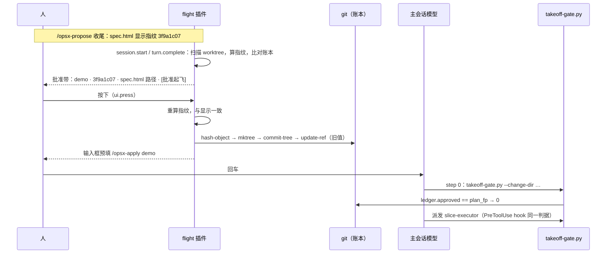

# 设计 · 起飞批准切换到「按钮 → 账本指纹」

**触发器命中**：跨模块（hooks / 新插件 / 安装脚本 / 命令 / skill / 文档）+ 新外部依赖（Claude Code mod API，early access）+ 安全语义变更（批准证据来源）→ 写实质设计。图示沿用本仓既有 design 的约定：plain Mermaid、轻量 C4（容器图 + 动态图），未单独向用户确认格式。迁移总图见 `docs/flight-control-plane.html`（2026-10-09 评审，D1–D7 全部按推荐裁决）。

## Context

**现状**（`template/.claude/hooks/takeoff-gate.py`，main 5545f68）：

- 判据：会话转录里最新一条「人类消息」（`human_text` 76 行起，排除 meta / sidechain / tool_result / 命令输出等形状）满足「含 `/opsx-apply`」或「≤40 字且含批准词」（`approval_of` 110 行），且时刻 ≥ 计划工件最大 mtime（`plan_mtime` 155 行；`PLAN_FILES` 38 行 = proposal / design / slices.json + specs）。
- hook 模式：起飞类派发识别（`is_takeoff_dispatch` 253 行）→ 从 tool_input 定位 change 目录（`find_change_dir` 224 行）→ 定位转录（`locate_hook` 244 行）→ **拿不到转录就放行**（`run_hook` 281 行）。
- CLI 模式供 `/opsx-apply` step 0 自检，exit 3 = 无批准 / 过期。

**在役 ADR**（全部为 DRAFT 命名，均 accepted）：`DRAFT-apply-as-flight`（确定性脚本编排 + 机械门禁）· `DRAFT-gate-evidence-not-self-reported`（判据不得来自被门禁方；真值源 = 转录 / 文件系统 / git / hook 留痕；判不出 fail-closed、hook 自身异常 fail-open；**人类批准证据 = 转录里人自己发的消息且晚于计划改动**）· `DRAFT-model-routing-defaults-for-template` · `DRAFT-review-orchestration-watermark` · `DRAFT-memory-as-fifth-resident-carrier` · `DRAFT-external-capability-intake`。本设计改变 `gate-evidence` 的第 4 条（批准证据来源），故由新 ADR 取代它（原则 1–3 在新 ADR 中原样保留）；其余在役 ADR 本次不受影响。

**实测基础**（2026-10-09，Claude Code 2.1.295，一次性 mod，零仓库改动）：

| # | 能力 | 结果 |
|---|---|---|
| S3 | 按钮按压 | 人按下批准带按钮 → `ui.press` 记下 `plugin / element / component=AbovePrompt / surface=terminal`；人的输入 `origin.kind = composer`，后台任务通知为 `task-notification`；模型侧工具中没有能触发按压的 |
| S4 | git 账本 | plumbing 追加串行 20/20，p50 67 ms、max 389 ms；8 个并发追加 1 成 7 被 `update-ref` 旧值校验拒绝，链长 21 不分叉不丢失 |
| S6 | 项目级分发 | `marketplace add --scope project` + `install -s project` 写入项目 settings 的 `extraKnownMarketplaces` / `enabledPlugins`；仓库与 worktree 内的 `claude -p` 都加载插件；用户级 `installed_plugins.json` 也会记一笔 |
| 附 | API 事实 | `$.session.model()` / `$.session.version()` 可用；`$.store` 落在 `~/.claude/plugins/store/<插件>_*.json`（明文，模型可改）；插件工具返回值须为字符串 |
| 附 | 测试 | `claude plugin test` 无 xfail 等价物；输出逐行 `(pass) <名>` / `(fail) <名>`，失败时退出 1 |

## Goals / Non-Goals

**Goals**
- 起飞批准的唯一证据 = 人的按钮按压写入账本、绑定计划内容指纹；门禁只比对指纹。
- 计划内容一变批准即失效；执行记账（勾选、渲染、飞行记录）不让批准失效。
- 模型侧没有任何写账本的入口；判定器只读。
- 插件缺席或版本过低时起飞被拒，并告诉人缺什么、怎么补。

**Non-Goals**
- 不迁编排（Workflow / integrator）、不迁路由、不迁收口门禁（stop-gate / test-evidence）——后续 change。
- 不做账本 tip 与 `$.store` 的完整性比对（SHIP 阶段的事，迁移阶段 4）。
- 不做撤销批准事件（不按即不批；需要撤销时改计划即可让指纹失效）。
- 不防蓄意伪造 git 对象的对抗者（威胁模型见 D7）。

## Decisions

### D1 指纹范围与规范化

| 候选 | 判断 |
|---|---|
| 沿用 mtime | ✗ `touch` / checkout 改 mtime 不改内容（误过期），checkout 旧版本内容变而 mtime 早（漏判） |
| 整个 change 目录取哈希 | ✗ tasks 勾选、spec.html 重渲染、飞行记录都会让批准失效，收口自己把自己拦死 |
| **只取定义计划的文件 + 规范化**（选） | proposal / design / slices.json / specs/**/spec.md / slices/*.md（除 `_interfaces.md`，它由 integrator 在飞行中写） |

- `slices.json` 解析后去掉 `gate.full_suite_sec`（基线实测耗时，不是意图），按 `sort_keys` 紧凑序列化；文本 CRLF→LF。
- 指纹 = sha256( 按相对路径排序的「`路径\t内容sha256`」逐行文本 )；路径用 `/`。
- 不复用 `slice-gate.py` 的 `plan_sha`（136 行）：那是「基线是否过期」的判据，只看 gate 命令与每片 verify，与「人批准的内容」是不同的不变量。
- 测试骨架（`tests/` 下的 strict-xfail 函数）不计入：它们在 change 目录外，且由门禁逐条核对。

### D2 账本：git 引用上的线性提交链

| 候选 | 判断 |
|---|---|
| change 目录里的文件 | ✗ 模型 Write / Edit 可直接改；与 merge 冲突；根 `.gitignore` 的 `*.log` 曾吞掉 evidence.log |
| `$.store` | ✗ 明文 JSON 在用户目录（S 附表实测），不随仓库走，审阅者看不到 |
| **`refs/flight/<change>/ledger` 提交链**（选） | 不在工作区（ref 本身是公共 git 目录下的普通文件，Write / Edit 写它由 D7 守卫拦截）；提交链即哈希链；worktree 间共享（refs 在公共 git 目录）；可随分支推送；与 slice-noreturn-resume 的 `refs/flight/<change>/<S>` 同命名空间 |

事件格式 v1：提交树里恰一个 `event.json` = `{"v":1,"ev":"approve","change","fp","at","by":{"plugin","surface","session"}}`；提交信息 `flight: approve <change> <fp前8位>`；线性（≤1 个父提交）。读取方任一违规即判损坏（exit 4），不做部分信任。

### D3 写在插件进程内，读在 Python

- **写**（TS，插件内）：`hash-object -w --stdin` → `mktree` → `commit-tree [-p 链尾]` → `update-ref <ref> <新> <旧|全零>`。所有写经模块内单一 Promise 队列串行；`update-ref` 旧值不符时重读链尾重试，最多 3 次（S4 实测并发只会被拒、不会写坏）。
- **读**（Python，`ledger.py`）：判定器只读，供 `takeoff-gate.py` 与插件共用。
- **为何不做 `ledger.py append`**：任何模型能调用的写入口都会复现 2026-09-10 的事故（模型自己跑 `timeline.py record approve`）。写入口只存在于插件进程内，且只由 `ui.press` 触发。
- **格式契约的测试**：Python 侧测试用 git plumbing 直接造合法 / 非法账本（测试内助手），TS 侧测试断言插件发出的 git 命令序列与事件字段；两侧都以 D2 的格式为契约。

### D4 批准交互

- 位置：输入框上方的批准带（`ui.render` 的 `AbovePrompt`），S3 实测按压可达。
- 候选来源：全部 worktree 下含 `spec.html` 且 `tasks.md` 有未勾选项的 change；同名去重只认分支 `worktree-<name>` 的 worktree（`openspec-git-discipline` 的权威命名），其次主 worktree；其余 worktree 里的同名目录是别的分支快照，忽略。
- 刷新时机：`session.start`、主会话 `turn.complete`、每次批准后；结果放 `$.state`，绘制只读状态。
- 按下时**重算指纹**，与显示的不一致则不写（防「看的是旧计划、批的是新计划」）。
- 写入成功后用 `$.prompt.fill` 预填 `/opsx-apply <change>`，**由人回车**起飞——不调用 `$.prompt.submit`：保持「人发起飞行」，且未实测 submit 对斜杠命令的行为。
- 同时显示 `spec.html` 绝对路径与指纹前 8 位；`spec.html` 顶部显示同一指纹，人肉眼核对。

### D5 起飞门禁切换

- 判据：`approved_fp(change_dir) == plan_fingerprint(change_dir)`，两侧都 import 判定器模块的同一函数（`takeoff-gate.py` 与 `plan_fp.py` / `ledger.py` 同目录，按路径加载）。
- 删除：`human_text` / `approval_of` / `latest_approval` / `plan_mtime` / `locate_*` 与 `--session`。保留：`is_takeoff_dispatch`、`find_change_dir`、`emit_deny`、`main` 的参数分流。
- fail 语义（沿用在役原则）：**没有批准记录、账本不可读（git 能执行但返回非 0，如不在仓库内）= 判定结果 → 拒绝**；ref 指向非提交 = 账本损坏 → 拒绝；git 不可执行、脚本异常 = 门禁自身故障 → hook 放行、CLI 以 3 退出并说明。（2026-10-09 PR #35 评审补：账本不可读原被当作故障放行）旧实现「拿不到转录就放行」的缺口随转录一起消失。
- 拒绝文案给出：`spec.html` 绝对路径、「在批准带按批准起飞」、`claude plugin marketplace add akarizo/intent-driven-claude-code --scope project && claude plugin install flight@intent-driven -s project`。
- 这是对原 `takeoff-approval` 能力（mechanical-takeoff-gates change）的整体取代；因 `openspec/specs/` 无已归档规格，以新能力 `ledger-takeoff-gate` 落规格，旧测试由 S4 改写。

### D6 插件如何找到判定器与 change

固定顺序探测，不读内容猜：hooks 目录 `[.claude/hooks, template/.claude/hooks]`（下游仓库是前者，本仓库是后者）；openspec 根 `[openspec, template/openspec]`。未用 `userConfig` 配置项：插件经 marketplace 安装后其配置是否能由项目 settings 提供未实测。探测不到判定器 → 批准带显示「找不到 plan_fp.py」，不提供批准（fail-closed）。

### D7 守卫与威胁模型

- `tool.call` 上拦截命令文本匹配 `refs/flight/[^\s'"]+/ledger` 的 Bash / Monitor，以及目标路径含 `refs/flight/` 或为 `packed-refs` 的 Write / Edit / NotebookEdit（主会话与子 agent 都拦，S2 实测子 agent 的 tool.call 可见）；`.catch` 中对命中模式的调用照样拒绝。（2026-10-09 PR #35 评审补：原只拦 Bash）
- 威胁模型（明说）：防**走捷径的模型**（直接写证据、自记批准）；不防**蓄意伪造**（例如用变量拼出引用名再调 plumbing、或改 `$.store` 明文文件）。后者需要的是 OS 级密钥，超出本仓库范围。

### D8 版本下限

下限 = 2.1.295（全部实测所用版本）。低于下限停用批准带与写入、提示版本要求；守卫照常。批准带初值即停用，每次会话启动先停用、确认版本达标后才启用——读不到版本时停留在停用（fail-closed；2026-10-09 PR #35 评审补）。理由：mod API 标注 early access，未实测版本上的行为不作保证。

### D9 分发

- 仓库根 `.claude-plugin/marketplace.json`：`{"name":"intent-driven","owner":{"name":"akarizo"},"plugins":[{"name":"flight","source":"./template/plugins/flight"}]}`；仓库公开，GitHub 源对任何人可用。
- `install.sh`：`claude` 在 PATH 上 → 在目标目录内 `claude plugin marketplace add <owner/repo> --scope project` + `claude plugin install flight@intent-driven -s project`；`<owner/repo>` 由 `REPO_URL` 解析；`enabledPlugins` 已含则跳过；无 `claude` → 打印两条命令；插件步骤失败只告警。
- ⚠ 现有 `tests/test_install.py` 的 `run_install` 会真实调用 PATH 上的 `claude`，S5 必须改为桩，否则测试会改动开发者本机的用户级插件记录（S6 实测已证实会写 `installed_plugins.json` / `known_marketplaces.json`）。

### D10 插件测试接入 pytest 门禁

`tests/test_flight_plugin.py` 以模块级缓存跑一次 `claude plugin validate` 与 `claude plugin test template/plugins/flight`，解析 `(pass) <名>` 行；每个 scenario 一个 pytest 函数（strict-xfail 骨架），断言同名 TS 测试通过。这样 `python3 -m pytest -q tests` 仍是唯一门禁命令。输出格式不是文档化契约 → 解析失败时断言信息直接打印原始输出，便于升级后修正。

## Risks / Trade-offs

- [mod API early access，跨版本会变] → 判定器（指纹、账本读取、起飞门禁）全在 Python，不依赖 mod API；插件只做交互与写入；版本下限；`tests/test_flight_plugin.py` 在每次升级 Claude Code 后跑出差异。
- [下游 BREAKING：没装插件就飞不了] → install.sh 自动装；拒绝文案给出完整安装命令；README 升级说明。
- [全新用户打开含项目级插件的仓库的首装流程未实测] → 拒绝文案兜底；列入 Open Questions，首个下游仓库升级时实测。
- [`$.prompt.fill` 未实测] → 预填失败时插件提示人手动输入 `/opsx-apply <change>`；不影响批准本身（账本已写）。
- [本仓库测试从此依赖本机 `claude` CLI] → 本仓库就是 Claude Code 工作流库；`tests/test_flight_plugin.py` 在缺 CLI 时断言失败并说明原因，不静默跳过（静默跳过等于门禁不存在）。
- [`claude plugin test` 输出格式变化] → D10 的原始输出打印。
- [Bash 守卫可被刻意绕过] → D7 威胁模型；起飞门禁仍只认账本内容，伪造需刻意构造 git 对象。
- [扫描 worktree 的开销] → 只在三个时机刷新，候选经 tasks 未完成 + 分支归属过滤后通常 0–2 个。

## Migration Plan

1. **本 change 自举**：本 change 用 main 上的旧机制起飞（转录批准）；新机制只由测试验证，不在本次飞行中启用（「飞行跑已安装的稳定版」）。
2. **合入后，本仓库维护者**在仓库根执行一次：`claude plugin marketplace add akarizo/intent-driven-claude-code --scope project && claude plugin install flight@intent-driven -s project`（本仓库根 `.claude/` 未跟踪，此设置只在本机生效）。此后本仓库的飞行一律用批准带。
3. **在途 change**：切换时刻所有旧批准作废（门禁不再读转录），需在批准带重新批准。2026-10-09 三查：11 个 change 全部完成、无 open PR，无在途飞行。
4. **下游仓库**：`install.sh --upgrade` 刷新 hooks 并安装插件；README 标注 BREAKING 与手动命令。
5. **回滚**：revert 合入提交即恢复转录判据；账本引用是惰性数据，留着无害，需要清理时由人执行 `git update-ref -d refs/flight/<change>/ledger`。

## Open Questions

- 全新用户（本机无安装记录）打开已声明项目级插件的仓库时，Claude Code 的提示与安装流程（S6 未覆盖）。
- marketplace 是否支持把插件钉在某个 tag / ref（`claude plugin tag` 存在，消费侧未查证）；本次用默认分支。
- `$.prompt.fill` 的实际表现（未实测，见 Risks）。
- ADR 编号：main 上现有 ADR 全是 DRAFT 命名，与 `openspec-git-discipline` 的「合入前编号」规则不符；本次新 ADR 同样以 DRAFT 提交，编号问题另议。
- ADR 风格偏好（`architectural-decision-records/preferences.md` 为 unset）：本次沿用 schema 的 adr 模板，与在役 ADR 一致。
- `takeoff-gate` 的 PreToolUse 对 `Workflow` 工具是否触发仍未实测（既有问题，不在本次范围；step 0 自检兜底不变）。
