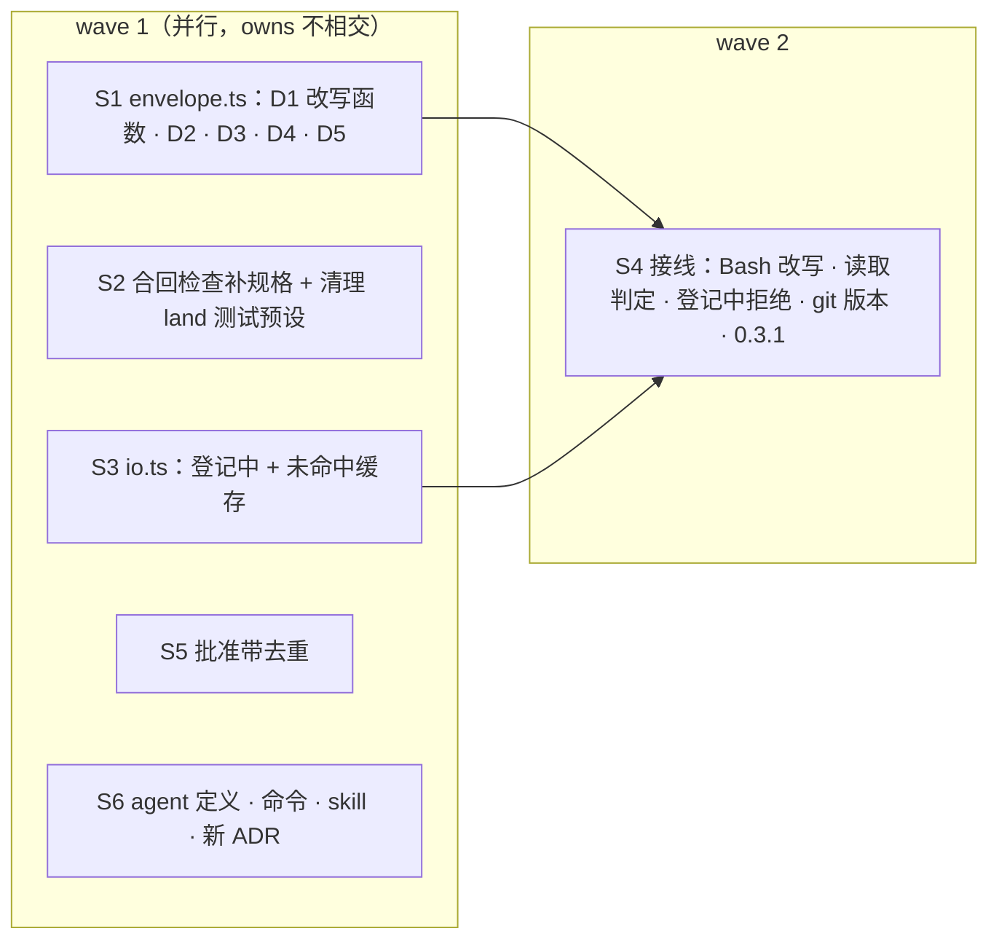

## Context

`DRAFT-flight-capability-envelope`（#41）定义了飞行 agent 的能力包络。#41 的全量评审留下 3 条安全类 MEDIUM 和若干 MEDIUM / LOW。另外实测发现，插件派发的 agent 并不在 `spawn` 时给的 `cwd` 里运行：shell 跟着主会话当前的目录走，证据见 proposal。

插件 API 的相关事实：
- `tool.call` 可以用 `next({ ...e, command })` 改写 Bash 命令，改写结果按 Bash 的 schema 校验。
- `tool.check` 的输入是权限判定读到的参数。
- `AgentSpawnInput.cwd` 的类型文档写的是「子 agent 运行的目录」，但实测没有生效（已在本地起草反馈）。

本计划第一次以 `flight-envelope-followups` 起飞时，会话还在跑 0.2.1，这次飞行已作废（见 proposal）。所以重飞前必须先 `/reload-plugins`，并核对插件版本。

## Goals / Non-Goals

**Goals**：飞行 agent 的 shell 与 git 改动固定在自己的 worktree 里；#41 评审的安全缺口全部闭合；修复体补加的合回检查有规格；派发登记的窗口不再放行。

**Non-Goals**：
- 测量协议、门禁红次数从账本统计：留给 `flight-measure`。
- 让引擎真正应用 spawn 的 cwd：这是引擎侧的问题。插件在 `tool.call` 层纠正，引擎修好后改写也不会造成伤害。
- 主会话只读的边界：不改，仍是尽力而为。

## Decisions

### D1 · 飞行 agent 的 Bash 一律前置 `cd '<自己的 worktree>' &&`
- **做法**：`tool.call` 对飞行 agent 的 Bash 返回 `next({ ...e, command: inWorktree(command, worktree) })`。
  - `inWorktree` 把 worktree 用单引号包起来，内部的 `'` 转义为 `'\''`。
  - 命令已经以这一段开头时不重复加。
- **效果**：裸 `git commit`、相对路径、测试命令都会落在正确的树里，与 agent 以为自己在哪无关。
- **配套**：`bashUpgradable` 认可开头这一段（目标正是自己的 worktree）。
- **否决的方案**：
  - 只靠提示词要求 `git -C`：#41 时还没有这条提示，有了也没法强制。
  - 要求每条改动类 git 必须带 `-C`：执行体会频繁被拒，靠它自己纠正不如直接改写。

### D2 · 改动类 git 只能作用于自己的 worktree
- **判定**：按段解析 git 调用，作用目录依次取：
  1. `-C 
`（可多次，按 git 语义逐级拼接）、`--git-dir=…`、`--work-tree=…`；
  2. 同一命令里前面某段 `cd <绝对路径>` 设定的目录；
  3. 都没有时，就是 D1 的 worktree。
- **结论**：
  - 子命令不是只读的（不在 `status`、`diff`、`log`、`show`、`rev-parse`、`ls-files`、`blame`、`grep` 里），且作用目录不在自己的 worktree 内 → 拒绝。
  - 只读子命令可以指向主仓库内的任何树，评审员要读 change 分支。
  - 相对路径的 `cd` 或 `-C` 无法判定，按「不在」处理。

### D3 · 拒绝表补齐（所有飞行角色）
- **git 子命令**：
  - `pull`；
  - `config` 除只读用法（`--get`、`--get-all`、`--get-regexp`、`--get-urlmatch`、`--list`、`-l`）之外一律拒绝。
- **git 全局选项**：`-c core.hooksPath=…`、`--config-env=core.hooksPath=…`（键名不分大小写）拒绝，与 `--no-verify` 同等对待。
- **长选项缩写**：门槛降到 `--` 之后 1 个字符，`--am`、`--d` 都会被识别。多拒的方向是安全的。
- **读标准输入的解释器**：一段的程序名是 `python`、`python3`、`node`、`bash`、`sh`、`zsh`、`ruby`、`perl`，参数里有单独的 `-` 或 `-s`，或者任意位置出现 `/dev/stdin` → 拒绝，理由「写成脚本文件再运行」。#41 的 `python3 -` 就挂起了 1 小时 24 分钟。
- **heredoc**：命令含 `<<` → 拒绝，理由「改用 Write 工具写文件」。heredoc 写文件会绕过写入包络。

### D4 · 白名单收紧
- 任何一段带前导 `VAR=`（例如 `GIT_EXTERNAL_DIFF=…`）→ 不升级。
- git 段的作用目录（D2 的规则）：只读子命令要在主仓库内，`add` / `commit` 要在自己的 worktree 内，否则不升级。

### D5 · Read / Grep / Glob 只在主仓库内免询问
- **判定路径**：Read 取 `file_path`；Grep / Glob 取 `path`，没有 `path` 时视为自己的 worktree。
- **免询问范围**：规范化后在主 worktree 内，这已经包含 `.worktrees/` 与 `.claude/worktrees/` 下的切片 worktree。
- **其余**：原样交回引擎判定。
- **与旧 ADR 的关系**：这一条修订 `DRAFT-flight-capability-envelope` 第 4 条「Read / Grep / Glob 答 allow」，由新 ADR 取代。

### D6 · agent 归属：登记中 fail-closed，未命中缓存
- **登记中**：`io.ts` 新增 `pending`。`ctx.spawn` 一拿到 agentId 就 `markPending(agentId, change)`；dispatch 事件写入时移出 `pending`，记进 `owners`。登记中的 agent：
  - Write / Edit / NotebookEdit / Bash 一律拒绝，理由「派发登记中，稍后重试」；
  - 其余工具交给下游；
  - `tool.check` 不升级。
- **未命中缓存**：`ownerOf` 扫完账本仍查不到时，把 agentId 记进 `misses`，下次直接返回 undefined。dispatch 事件写入时清空 `misses`。

### D7 · 合回检查补规格
把 #41 修复体与 R2、R3 已经实现的行为写成 scenario，映射到已有测试：
- 合回前，第一父链上有改动本片 owns 的直接提交 → 拒绝；
- 合并结果树等于 HEAD 的树 → 拒绝；
- 分支尖端是第一父链上合并提交的第二父 → 视为已合回、只补记账；
- 零提交的切片分支不算已合回；
- 派发提示词首行写明 agent 自己的 worktree。

另外，清理 `land.test.ts` 与 orchestrator 测试世界里失效的 `--is-ancestor` 预设。

### D8 · 起飞检查 git 版本
起飞时运行 `git --version`，低于 2.38 就拒绝起飞，回复写明「flight 需要 git ≥ 2.38（合回用 merge-tree --write-tree）」。

### D9 · 批准带去重
按「批准起飞」时，如果账本里上一次 takeoff 之后最后一条 approve 的指纹和这次相同，就不再追加，只 toast「已批准（指纹相同），无需重复按」。

### D10 · 文档与 ADR
- **agent 定义**：`agents/executor.md`、`fixer.md`、`reviewer.md` 加一条：git 一律作用于自己的 worktree（插件会把 Bash 固定在那里）；禁止 heredoc 与读标准输入的解释器，要写成脚本文件再运行，或用 Write 工具。
- **命令与 skill**：`opsx-apply.md` 与 `openspec-apply-change/SKILL.md` 的权限边界段同步修改。
- **新 ADR** `DRAFT-flight-envelope-tightening`：`Status: accepted, supersedes DRAFT-flight-capability-envelope`。全文重述包络，并标出 D1–D6 的修订点。旧 ADR 原文不动。

### D11 · 版本
插件版本升到 0.3.1。

### 切片与 wave

## Risks / Trade-offs

- **这次飞行跑在 0.3.0 上，Bash 改写还没生效**：执行体仍在主会话的目录里。主会话停在已作废的 `.worktrees/flight-envelope-followups`（停车位），并且全程不 cd。执行体若有裸 git 写操作，只会落到那条作废分支上，既不碰本 change 的分支，也不碰 main。
- **改写后执行体看到的 `pwd` 是自己的 worktree**，与它环境信息里写的主会话目录不一致。提示词首行已经写明 worktree（#41），两者一致。
- **拒绝 heredoc 与读标准输入的解释器，可能误伤合法写法**：拒绝理由直接给出替代做法。
- **D5 收紧后**，读取主仓库之外的文件会在 default 模式下弹询问。这正是收紧的目的。

## Migration Plan

合入后执行 `claude plugin marketplace update intent-driven && claude plugin update flight@intent-driven`，再 `/reload-plugins`，确认版本 0.3.1。

## Open Questions

无。
