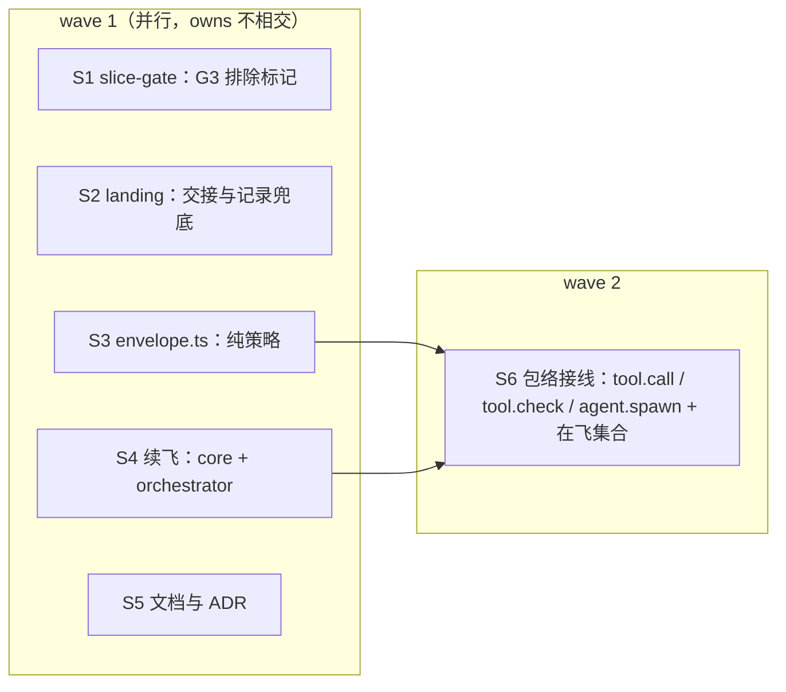

## Context

flight 插件 0.2.1 的状态机已接管 `/opsx-apply`，首飞（PR #40）在真实飞行里跑通了派发、收口门禁、合回、评审、final、落地。同时暴露出续飞与落地交接上的缺陷，见 proposal。

评审页 `docs/flight-orchestrator.html` 的 D4（能力包络）选了 A：专用 agent 类型，加上 tool.call 按 agentId 限写；飞行中主会话对源码只读。agent 类型已在 3a 落地，剩下的包络部分在本 change。

相关实测（2.1.295）：
- `tool.call` 带 agentId，越界 Write 被拒后 agent 没有改走 Bash（S2）；6 个并行 agent 没有串话（X5）。
- `tool.check` 对自家 agent 答 allow，Write 与 `git commit` 即放行，不弹询问（X1p）。
- `tool.check` 的 `next(e)` 返回引擎自己的判定（规则、模式、PreToolUse），hook 可以改答 allow / ask / deny；输入带 `agentId` 与组织上限 `ceiling`。
- `agent.spawn` 的输入带 `subagentType`、`parentAgentId`；`next.origin` 指明是哪个插件的 hook 帧触发了派发。

## Goals / Non-Goals

**Goals**
- 续飞对门禁已绿的切片零 token 补跑门禁，不再重置 base，不再出现假红。
- 停飞或中断之后能直接再起飞；落地交接失败不污染账本。
- 飞行 agent 的写入与危险 git 操作由插件按角色强制；包络内的操作在 default 模式下也不弹询问。
- 飞行中主会话不能随手改在飞的 change worktree。

**Non-Goals**
- 测量协议（RED / GREEN 由控制面执行）、门禁红次数从账本统计、删除 test-evidence hook 的飞行职责：都留给 `flight-measure`。
- `/flight status | abort | resume`、面板、删除旧引擎：3c。
- 在本仓库根 `.claude/` 注册 `/pr-ship`：那是本机未入库的配置，不归 change 管，见 Open Questions。

## Decisions

### D1 · 续飞：控制面用原 base 补跑门禁（零 token）
某个切片在上一 attempt 派过执行体（且那次没被记阻断），本 attempt 还没派过执行体时，处理方式如下：
- **最近一次门禁绿，且切片 worktree 还在**：动作 `regate`。控制面在该 worktree 里跑 `slice-gate gate <S> --base <那次门禁的 base>`，结果记成本 attempt 的 gate 事件，`agent` 为 `regate`。
  - 绿：照常合回。如果分支早已合入，`merge --no-ff` 只会得到 Already up to date，之后照常记 merge、刷新接口摘要。
  - 红：续派执行体，`slice-gate start` 带 `--base <原 base>`。
- **其余情况**照旧续派执行体；能从账本查到 base 时同样带 `--base`。

为什么不只是续派时带 base：门禁已绿的切片，派模型去「确认一下」是白花 token（铁律 9）。首飞 attempt 2 的 S1、S2 本来都可以零 token 合回。

### D2 · G3 不把切片标记当源码
`cmd_gate` 构造 G3 源码列表时排除 `MARKER`，与 `ownership_violations`、`_ckpt_restore`、stray 检查保持一致。

### D3 · 起飞时只剩飞行记录脏，就先提交再起飞
起飞检查发现工作区不干净时，如果每个脏路径都是本 change 目录下 `RECORD_FILES` 里的文件（`timeline.md`、`gate-report.md`、`evidence.log`、`slices/_interfaces.md`），就先 `commitRecords`（`chore(flight): 记录`）再继续；有任何别的脏路径，照旧拒绝。

选在起飞侧而不是停飞侧做，是因为它同时覆盖停飞、会话中断、进程被杀三种情形。

### D4 · 落地交接与终态
- **交接失败**：`land` 事件写入后，`runCommand('pr-ship')` 抛错不再向上冒出（否则 drive 会补记 halt）。改为打印一行并 toast「已落地，但接 /pr-ship 失败：<原因>；请手动运行 /pr-ship」。
- **飞行记录兜底**：`flightRecord` 里 `timeline report` 的调用包在 try/catch 里，抛错与非 0 退出走同一个分支；stderr 首行为空时写 `exit <code>`。
- **终态短路**：`driveNow` 在算 `plan_fp` 之前，先判本 attempt 是否已有 land / halt，有就直接返回。

### D5 · 写入包络：按 agentId 找角色，按角色限路径
飞行 agent 的 Write / Edit / NotebookEdit（`file_path`，`NotebookEdit` 为 `notebook_path`）先规范成绝对路径，再按角色判断：

| 角色 | 可写 |
|---|---|
| 执行体 | 自己的切片 worktree 内、相对路径匹配本片 `owns` |
| 修复体 / 解冲突 agent | 自己的 worktree 内、相对路径匹配全部切片 `owns` 的并集 |
| 评审员 | 不可写 |

- **匹配语义**：与 `slice-gate.py` 的 `glob_match` 一致：精确匹配、fnmatch、`dir/**` 前缀。
- **拒绝理由**：写明角色、切片和越界的相对路径。
- **找角色**：用 agentId 找飞行与角色。先查内存缓存（派发时写入）；查不到就退回现有的 `flightOfAgent` 扫账本。
- **非飞行 agent**：不属于任何飞行的 agent 一律放行（`next(e)`）。
- **Bash 写文件**：绕得过这层预拦。权威核对仍是门禁的 owns 检查（`ownership_violations`），预拦只是尽力而为。

### D6 · Bash：危险 git 一律拒；只给白名单免询问
**拒绝（所有飞行角色）**：
- 把命令按 `&&`、`||`、`;`、`|`、换行切成段。每段跳过前导的 `VAR=…` 与 `git` 的全局选项（`-C <path>`、`-c <k=v>`、`--git-dir=…`、`--work-tree=…`），取出子命令。
- 子命令属于 `push`、`merge`、`rebase`、`reset`、`checkout`、`switch`、`worktree`、`update-ref`、`symbolic-ref`、`stash`、`tag`、`cherry-pick`、`revert`、`clean`、`filter-branch`、`replace`、`notes` 的，拒绝。
- `branch` 带 `-d`、`-D`、`-m`、`-M`、`-f`、`-c`、`-C` 的，拒绝。
- `commit` 带 `--amend` 或 `--no-verify` 的，拒绝。
- 命令全文含 `refs/flight/` 的，拒绝。
- **评审员另外拒绝** `add`、`commit`、`rm`、`mv`、`apply`、`am`。

**免询问白名单（ask 升 allow）**：只有每一段都命中下面之一时，才升级：
- 等于 `slices.json` 的 `gate.test` / `gate.lint` / `gate.typecheck` 或某片的 `verify`，或以其开头后接空格；
- 只读 git：`status`、`diff`、`log`、`show`、`rev-parse`、`ls-files`、`blame`、`grep`；
- 执行体与修复体的 `git add`、`git commit`（不带 `--amend` / `--no-verify`）。

命令中出现以下任一时一律不升级：`$(`、反引号、`<`、`>` 重定向（`2>&1` 除外）、行尾或段中的 `&` 后台。

不在白名单内的命令按用户自己的权限设置处理，可能会弹询问。

**理由**：执行测试本来就在人已批准的计划之内，所以门禁和 verify 命令可以免询问。但插件不能越过用户设置，把任意 shell 权限交给可能被注入提示的模型。否决「对飞行 agent 的 Bash 一律 allow」。

### D7 · `tool.check`：只升 ask，只在包络内
`tool.check` hook 先取 `const v = await next(e)`：
- 调用来自主会话或非飞行 agent → 原样返回 `v`。
- `v.decision` 不是 `ask` → 原样返回，不推翻引擎的 deny，也不收回 allow。
- `e.ceiling === 'ask'`（组织上限）→ 原样返回。
- 以下情形答 `{ decision: 'allow', reason: 'flight 包络内' }`：
  - Read / Grep / Glob；
  - D5 判定在包络内的写入；
  - D6 白名单命中的 Bash；
  - 评审员调用 `mcp__flight__submit_findings`。
- 其余情形原样返回 `v`。

包络外的写入和危险 Bash 已在 `tool.call` 被拒，到不了这里。

### D8 · 飞行中主会话只读（尽力而为，边界写明）
- **在飞集合**：插件在内存里维护一个「在飞」集合，记录每个在飞 change 的 change worktree，以及切片 worktree 的前缀 `<主 worktree>/.claude/worktrees/flight-<change>-`。集合只在账本写入点 `appendEvent` 维护：takeoff 加入，land / halt 移出。
- **拦截规则**：
  - 主会话（没有 agentId）在在飞树内的 Write / Edit / NotebookEdit 一律拒绝，理由写明「飞行中，主会话对 <change> 只读；等落地或停飞」。
  - 主会话的 Bash 命令文本里出现在飞树的绝对路径，且含改动类 git 子命令（D6 拒绝表，加上 `add`、`commit`、`rm`、`mv`、`apply`、`am`、`restore`）或 `>` 重定向时，拒绝。
- **已知边界**：
  - shell 已经 `cd` 进在飞树后、不带路径的 `git commit` 拦不到；
  - 会话重启后集合为空，直到再次起飞（3c 的 `/flight resume` 负责重建）。

  这两点写进命令文档与 ADR。

### D9 · `agent.spawn` 守卫
- `subagentType` 以 `flight:` 开头，而 `next.origin.plugin !== 'flight'` → 拒绝：「flight:* 只能由 flight 控制面派发」。
- 由 flight 插件派发的 `flight:*`，`model` 为空 → 拒绝：「派发须显式指定 model（铁律 11）」。
- `parentAgentId` 属于某个在飞飞行的 agent → 拒绝：「飞行中的 agent 不得再派发子 agent」。
- 守卫 hook 自身抛错时，对 `flight:*` 拒绝，其他类型放行（`.catch`）。

### D10 · 记录与版本
- 新增 ADR `DRAFT-flight-capability-envelope`（accepted），承接 `DRAFT-flight-orchestrator-state-machine`「中性」一条里的「按 agentId 限写与 `tool.check` 权限策略在后续 change 落地」，不取代它。
- 命令与 skill 的「执行引擎（先读）」各加一条权限边界说明。
- 插件版本升到 0.3.0：新增能力，且收紧了飞行 agent 的行为。

### 切片与 wave

6 片 2 层，切片配额与 DAG 深度都留了余量，给修复用。

## Risks / Trade-offs

- **这次飞行跑在 0.2.1 上**：D1–D4 的修复对本次飞行不生效。中途停飞的话，续飞会再撞到 S1 式的假红；落地交接 `/pr-ship` 仍会失败并记 halt，届时由主会话按 `pr-ship.md` 完成，并如实记录。
- **包络误拒合法写入**：owns 写得不全时，执行体会被拒。拒绝理由会写明 owns，执行体只能如实上报；这本来就该在规划时补 owns。规则与 `slice-gate` 同语义，所以门禁通过的写法也一定能通过包络。
- **Bash 白名单太窄**：default 模式下执行体跑白名单外的命令会询问人，飞行可能停下等人。这是有意的取舍（D6），用户可以在自己的设置里放行常用命令。
- **主会话只读是尽力而为**：边界见 D8。权威防线仍是合回时 git 的冲突和 final 门禁。
- **合入后的下一次飞行是包络的第一次实战**（`flight-measure`）：如果包络拦错，那次飞行会停在 tool.call 的拒绝上，拒绝理由会写进转录。

## Migration Plan

合入后执行 `claude plugin marketplace update intent-driven && claude plugin update flight@intent-driven`，再 `/reload-plugins`，确认版本 0.3.0。旧引擎（`--engine=workflow`）不受影响。

## Open Questions

- 本仓库根 `.claude/` 没有 `commands/`，落地时 `/pr-ship` 接不上。这属于本机配置，要不要在主检出补一个指向 `template/.claude/commands/pr-ship.md` 的软链，由人决定，不在本 change 内。
