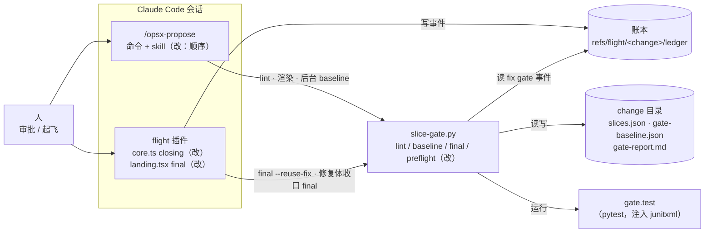
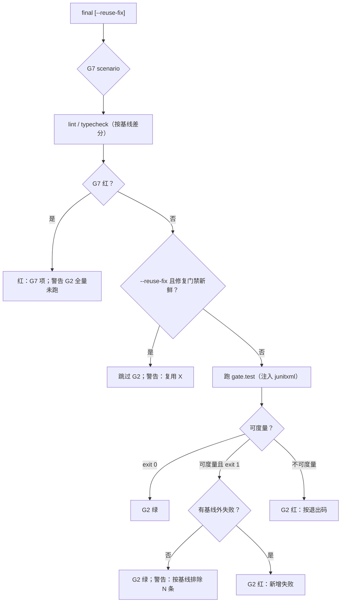

## Context

触发器命中：跨模块（判定器 `slice-gate.py`、插件状态机 `core.ts` 与落地动作 `landing.tsx`、propose 命令与 skill、schema 说明），并且是性能改动。动机与实测见 proposal。

现状要点（读码核实，main @ `6eadf6e`）：
- `cmd_final`（`slice-gate.py`）按 G2 全量 → lint / typecheck → G7 的顺序判；G7 只跑映射到 scenario 的测试，秒级。
- `cmd_baseline` 先跑 `gate.test`；`gate.test` 缺失时用 `detect_test_cmd` 探测并写回 `slices.json`。`gate.test` 非 0 即判基线红。
- lint / typecheck 已经按基线差分（`gate_cmd_verdict`）；`gate.test` 没有差分，所以 afa 每个 change 都手写 deselect 脚本。
- 新引擎 `closing()`：全部切片 merged 或 blocked、评审收齐之后，有阻断 finding 就派修复体，再 final；没有检查切片是否 blocked。修复体收口时 `onLandingStop` 在修复 worktree 里跑 `slice-gate.py final`（全量），合回后 `runLandingAction` 的 final 动作在 change worktree 里再跑一次。
- `_final_fresh`（ship 用）：final 的 commit 是 HEAD 的祖先、且之后只改了 changes 根下的记账文件，就算新鲜。
- 计划指纹（`plan_fp.py`）不读 `verify/`，并且去掉 `gate.full_suite_sec`；但读 `gate.test`。
- `PYTEST_ADDOPTS=--junitxml=<f>` 已实测：包装脚本里的 `pytest.main()`、bash 包装且覆写 `PYTHONPATH` 两种形态都会写出 junit（系统 pytest 与 afa 的 pytest 7.4.4）。

### 图（c4-diagrams：目的 = 现有代码的设计评审；格式 = 普通 Mermaid flowchart；严格度 = 轻量 C4。三项沿用审批页已确认的形式，作为假设记录）

容器视图，标出本 change 改动的部分：

动态视图，final 一次判定：

图说明：
- **边界**：判定全部在 `slice-gate.py` 里（零 token）；插件只决定调用时带不带 `--reuse-fix`，以及何时停飞。
- **信任**：复用依据是账本里插件写下的 fix gate 事件，加上 git 历史，不接受调用方传入的结论。
- **假设**：`gate.test` 内部只调一次 pytest 时 junit 完整；调多次时由汇总行计数守卫兜底。
- **未知**：非 pytest 的测试框架（npm、go）没有差分，维持退出码语义。

## Goals / Non-Goals

**Goals**
- 消掉白跑的全量：G7 必红时不跑；修复门禁新鲜时不重跑；预存红不再需要预跑一遍去收集。
- 有切片 blocked 时不派修复体、不跑 final。
- 审批不再等 baseline。

**Non-Goals**
- 执行体 worktree 的基点问题：#42（0.3.1）已解决，3c 删除旧引擎后不复存在。
- 旧 Workflow 引擎（`opsx-apply.js`）的编排：不改。它经 `slice-gate.py` 自动吃到 D1、D2；D3、D4 不进旧引擎，原因见 D3。
- 切片 `verify` 的语义：仍要求在基线上绿，不做差分。
- afa 侧的 pytest-xdist：属于 afa 仓库，不在本 change。

## Decisions

### D1 · final 的判定顺序：G7 → lint / typecheck → G2（可跳过）
- G7 有违规时不跑 `gate.test`。failed 只含 G7（以及 lint / typecheck 的红项），warnings 追加「G2 全量未跑：G7 已红，scenario 全绿后重跑 final」。
- lint / typecheck 照跑：通常只要秒级，结论更完整。
- 其余输出（JSON 形状、gate-report.md 行、timeline 的 final 事件）不变。
- **否决**：只调换顺序、G7 红仍跑全量（没有收益）；G7 红时 lint / typecheck 也跳过（少了信息，几乎不省时间）；G7 与 G2 并行（测试会争用资源，结论也难排序）。

### D2 · `gate.test` 按基线逐条差分
- **注入**：`baseline` 与 `final` 运行 `gate.test` 时，环境变量 `PYTEST_ADDOPTS` 在原值之后追加 ` --junitxml=<临时目录>/junit.xml`。命令文本不变。
- **标识**：每个带 `<failure>` 或 `<error>` 子节点的 `<testcase>` 记为 `classname::name`；同一标识只记一次。
- **可度量条件**（全部满足）：
  1. 退出码为 1（pytest 的「有测试失败」；0 直接绿，2/3/4/5 = 中断、内部错误、用法错误、没收集到测试，一律不可度量）；
  2. junit 文件存在且可解析；
  3. 输出里 pytest 汇总行（形如 `N failed, M passed … in X.XXs`，可带 `=` 包围）恰好一行；
  4. 汇总行的 failed 与 error 合计，等于 junit 各 testsuite 的 `failures` 与 `errors` 合计。
- **baseline**：
  - exit 0 → 与现在一致；
  - 可度量且 exit 1 → ok，`test.failed = [标识…]`（排序），warnings 追加「预存红 N 条已记录，final 按基线差分」；
  - 其余 → 红，reason 写「全量测试在基线上红（exit <rc>；按退出码判：<不可度量的理由>）」。
- **final**：
  - exit 0 → 绿；
  - 可度量且 exit 1：新增 = 本次标识 − 基线 `test.failed`。新增为空 → 绿，警告「G2 test: exit 1，失败均为基线预存红（N 条已按基线排除）」；否则红「G2 test: exit 1（新增 k 条失败）」，后接至多 6 条新增标识；
  - 基线缺 `test.failed`（旧格式或基线本为绿）→ 视为空集，即任何失败都算新增，与现在语义一致；
  - 不可度量 → 红「G2 test: exit <rc>（按退出码判：<理由>）」并附输出尾部。
- **否决**：
  - 用 `-p` 加载自写 pytest 插件：afa 的 `_env.sh` 覆写 `PYTHONPATH`，插件模块找不到（G7 能用它，是因为 G7 自己直接调 pytest）；
  - 解析终端里的 FAILED 行：依赖 `-rfE` 与输出格式，参数化 id 里还会有空格；
  - 自动生成 deselect 清单：仍要两遍全量。
- 长期契约记入 ADR（`DRAFT-test-gate-baseline-diff`）。

### D3 · `final --reuse-fix`：复用新鲜的修复门禁
- **取证**：`ledger.read_events(change_dir)`（同目录模块，与 `takeoff-gate.py` 的用法一致），取最后一条 `ev == "gate"` 且 `slice == "fix"` 的事件。
- **条件**：`ok is True`、`commit` 非空，且 `_final_fresh(root, change_dir, commit)` 为真。
- **满足时**：跳过 G2，其余照 D1 判；warnings 追加「G2 test: 复用修复门禁 <commit 前 10 位> 的全量结论（其后只有记账改动）」；JSON 增加 `"reused": <commit>`；gate-report.md 行与 timeline 记法与正常 final 相同（commit = HEAD）。
- **不满足或读账本失败**：与不带参数时完全一致；读账本失败时 warnings 记一行原因。
- **插件**：`runLandingAction` 的 final 动作改为 `slice-gate.py final --change-dir <dir> --reuse-fix`（change worktree）；`onLandingStop` 的修复体收口门禁不带该参数。
- **否决**：
  - 插件自己算新鲜度、把结论传给 slice-gate：判定器就得接受调用方给的结论，等于自证；
  - 要求树完全相同：修复合回是 no-ff merge，前后还有「chore(flight): 记录」提交，树几乎总是不同；
  - 连 G7 一起复用：G7 只要秒级，在合回后的树上重判一遍更稳；
  - 也给旧引擎用：旧引擎的修复门禁结论是 agent 转述的 JSON，不在账本里，没有可信来源。

### D4 · `closing()`：有计划切片 blocked → 停飞
- 在 `closing()` 开头判断：`stuck = plan.waves.flat().filter(s => blockedNow(s))`。非空 → 返回 `[{ kind: 'halt', reason }]`。
- `reason` 格式：「切片 blocked：S1（G7 x）、S3（依赖已 blocked：S1）；未派修复、未跑 final。修好后重发 /opsx-apply <change> 续飞，只重派这些切片」。每个切片的原因取首行。
- `closing()` 只在全部 wave 完成、评审收齐后才被调用（现有逻辑），所以停飞前评审结论都已进账本，续飞时可以直接用。
- `review:<S>` 与 `fix` 不在 `plan.waves` 里，不受影响。
- **续飞**：现有 `firstDispatch` 对上一 attempt blocked 的切片返回全新派发、已合回的切片不再派发，本 change 只补 scenario 覆盖，不改逻辑。
- **否决**：
  - 维持现状（派修复、跑 final）：final 必红；修复体会被别片的 xfail 卡住收口；
  - 一有切片 blocked 就立刻停飞：独立 wave 的进度会丢，续飞照样要做。

### D5 · baseline 运行标记与 preflight；`gate.test` 必填
- **lint**：`lint_plan` 在 `gate.test` 缺失或为空白时追加错误「gate: gate.test 缺失（须显式写出，baseline 不再自动探测写回，避免改动计划指纹）」。`cmd_baseline` 保留 `detect_test_cmd` 作兜底（对已通过 lint 的计划不会触发）。仓库内现有 change 的 `slices.json` 都已有 `gate.test`（已核对）。
- **标记**：`cmd_baseline` 在跑任何命令前写 `gate-baseline.json = {"running": true, "pid": <pid>, "started": <ISO>}`，结束时整体覆盖为最终结果。
- **preflight**：在现有四项校验之前，如果 `running` 为 true：
  - `os.kill(pid, 0)` 成功或 `PermissionError` → 「基线仍在跑（已 X 分钟，上次全量约 Y 秒）：等它结束再起飞」；
  - `ProcessLookupError` → 「基线中断（进程 <pid> 已不在）：重跑 slice-gate.py baseline」。
- **否决**：
  - 标记放单独文件：多一个可能被误 commit 的文件，preflight 也要多读一处；
  - 插件起飞后等待 baseline：要改 `orchestrator.tsx` 的起飞流程（审批页 D3 选 A）。

### D6 · propose 的步骤顺序（命令与 skill 同改）
- **新顺序**：写全部工件 → lint → 渲染 `spec.html` → 后台运行 `slice-gate.py baseline` → 硬交接 → baseline 结束（后台通知）时只报告一行。
  - 绿：「基线绿（全量 N 秒；预存红 k 条）」；
  - 红：列出 reasons，并说明修 `gate.test` / `verify` / 环境后重跑 baseline；修改涉及计划文件时重新渲染并重新批准。
- **交接新增两点**：baseline 跑完前起飞会被 preflight 拒绝；工件在 baseline 报告之后再 commit（baseline 结束会改写 `gate-baseline.json` 与 `slices.json` 的耗时）。
- **schema 的 tasks 说明**：写明 `gate.test` 必填；pytest 的预存红由 baseline 记录、final 按基线差分，无需手写 deselect。
- `tests/test_template_docs.py::test_propose_baseline_red_stops` 依赖旧顺序（从 baseline 截取到 spec_html），按新顺序改写。原有断言保留：`gate-baseline.json`、「停下报告」、verify 在基线上必须绿、命令与 skill 的 hook 集合一致。

### D7 · 插件补丁版本 +1
`plugin.json` 的 version 在执行时 worktree 里的当前值上升一个补丁号，由改 `landing.tsx` 的切片负责。不写死目标版本：`flight-measure`（目标 0.4.0）与本 change 都在待批，谁先合入不确定，写死会让后合入的一方改计划、重新批准。

## Risks / Trade-offs

- [预存红掩盖「本来就红、又被改坏」的测试] → 与 afa 现在手写 deselect 的效果相同，不新增盲区；baseline 与 final 的警告都写出预存红条数。
- [`gate.test` 里多次调 pytest，junit 只剩最后一次] → 汇总行必须恰好一行，否则按退出码判红，不会误判为绿。
- [pytest 汇总行格式随版本变化] → 汇总行识别是可度量条件之一，识别不了就按退出码判红（fail-closed）；本仓库的测试覆盖 `-q` 与默认两种形态。
- [失败与错误的计数口径不一致，例如同一测试 call 失败、teardown 也出错] → 计数对不上就判不可度量，按退出码判红（保守）。
- [修复门禁之后有人手改代码，又带 `--reuse-fix` 跑 final] → `_final_fresh` 要求之后只有记账改动，改了代码就照跑全量。
- [baseline 进程被杀，标记残留] → preflight 报「中断」，提示重跑。
- [D4 停飞后人以为飞行失败] → 停飞原因写明哪些切片 blocked、怎么续飞；飞行记录照常打印。
- [G7 绿时 scenario 测试多跑一遍] → 只多 scenario 测试本身（afa 33 条，秒级）。
- [与待批的 `flight-measure`（3b-3，worktree `.worktrees/flight-measure`）改同一批文件] → 函数层面不重叠：
  - `slice-gate.py`：它改 G5、`start` 与 base、`ledger.py`；本 change 改 `cmd_final`、`cmd_baseline`、`cmd_preflight`、`lint_plan`；
  - `core.ts`：它接 measure 事件与 dispatch 的 base；本 change 只改 `closing()`；
  - `plugin.json`：两边都升版本，本 change 不写死目标版本（D7）。
  
  后合入的一方起飞前预合并 main：文件头注释可能有文本冲突，按两边内容合并；之后重跑 baseline，计划文件有改动就重新渲染审批页并重新批准。另外，本 change 的 D3 读账本：若账本里出现本分支 `ledger.py` 不认识的事件类型（如 `measure`），`read_events` 会抛 `LedgerInvalid`，D3 按「读账本失败 → 不复用、照跑全量」处理，fail-safe。

## Migration Plan

1. 合入后：`claude plugin update` → `/reload-plugins`，确认插件版本为本 change 升出的版本。
2. 已有 change：旧格式的 `gate-baseline.json`（没有 `test.failed`）在 final 里视为空集，语义与现在一致；不需要重跑 baseline。
3. afa 等已经手写 deselect 脚本的仓库：旧 change 照常用；新 change 不必再写，baseline 一遍即可。
4. 回滚：回退本 change 的提交即可，不涉及数据迁移。账本事件形状不变。

## Open Questions

无。审批页（`docs/flight-gate-speedup.html`）的 D1–D4 已全部按推荐项确定（2026-10-10）。
