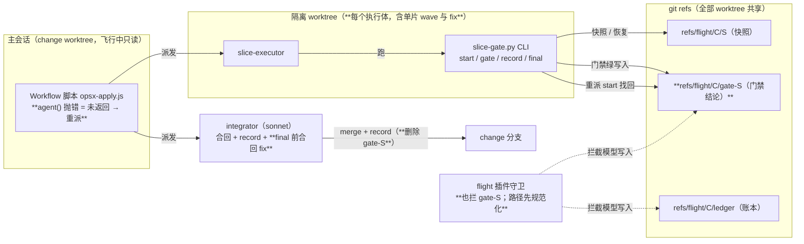
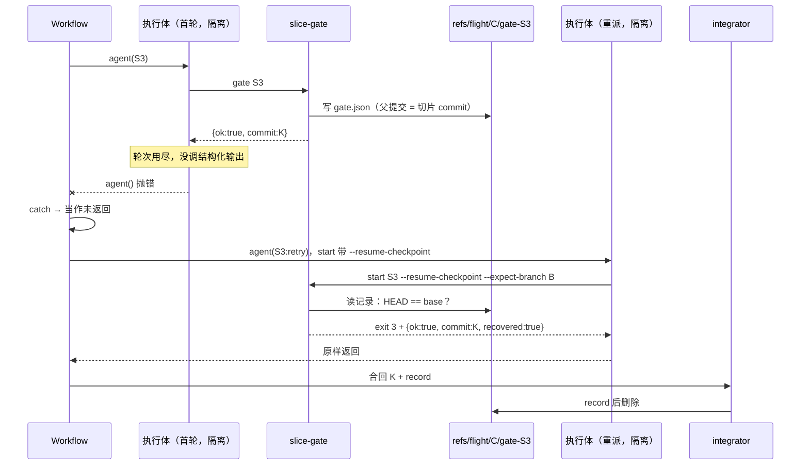

## Context

flight-approval-ledger 的飞行（2026-10-09，两段工作流 `wf_393c81e6-c64` / `wf_d306cb37-70a`）实测到三处失真，事实如下。

| 缺陷 | 实证 | 代码位置（main 5a110aa） |
|---|---|---|
| 重派失效 | journal 里 S3 只启动过一次；工作流结果 blocked S3 的原因是「agent 未返回（已重派一次）」；运行时报 `parallel[2] failed: agent({schema}): subagent completed without calling StructuredOutput` | `template/.claude/workflows/opsx-apply.js:150-153` 的 `.then` 只处理 resolve；`:156` 写死原因 |
| 门禁已过却只能重做 | 门禁通过时删除切片标记和快照 ref，`start --resume-checkpoint` 无物可恢复 | `slice-gate.py` `cmd_gate` 末尾的 `_ckpt_delete`；`cmd_start` 只认快照 |
| G7 假绿 | 第一段 final 报 36/36，独立跑 pytest 仍有 18 个 xfailed（骨架用了 `@XF` 别名） | `slice-gate.py:61` `MARK_RE = xfail\|skip`；`scenario_status` 按装饰器源码文本判断 |
| Stop hook 误拦 | 单片 wave 的 S5、S6 执行体在主会话 worktree 写下 `.openspec-slice`；主会话与只读评审员结束回合都被拦 | `opsx-apply.js:148` `iso = wave.length > 1 ? 'worktree' : undefined`；fix 阶段不隔离；`stop-gate.py` 只看 cwd 里的标记 |

还有两处测试盲区：
- 工作流测试的模拟器（`tests/test_agents_workflow.py` HARNESS）用「返回 null」模拟未返回，`parallel` 用 `Promise.all`，与运行时不符，所以重派失效没被测出来。
- PR #35 评审留下 7 条 MEDIUM 与 3 条 follow-up LOW（见 `template/openspec/changes/flight-approval-ledger/review-findings.json`），具体位置写在各切片包里。

现行 ADR（按 supersedes 关系推出）：
- `DRAFT-apply-as-flight`
- `DRAFT-approval-bound-to-plan-fingerprint`
- `DRAFT-flight-control-plane-in-mod`
- `DRAFT-external-capability-intake`
- `DRAFT-memory-as-fifth-resident-carrier`
- `DRAFT-model-routing-defaults-for-template`

已被取代：`DRAFT-review-orchestration-watermark`、`DRAFT-gate-evidence-not-self-reported`。

本设计与现行 ADR 一致：「执行体一律隔离」落实 `flight-control-plane-in-mod` 的「状态单一写者」；门禁结论仍由脚本产出、写入 git，符合 `approval-bound-to-plan-fingerprint` 第 1–3 条。

图示沿用上一 change 的写法：plain Mermaid（flowchart / sequenceDiagram），轻量 C4 风格（容器级 + 一张动态图），不做组件级。

## Goals / Non-Goals

**Goals:**
- 执行体没交回结论时，重派一定发生；门禁已过的情形用约 2 轮找回结论，不重做。
- 「scenario 已通过」以实际运行结果为准，与写法无关。
- 飞行中只有 integrator 写 change 分支；主会话 worktree 不出现切片标记。
- 关闭 PR #35 留下的 7 条 MEDIUM 与 3 条 follow-up LOW。

**Non-Goals:**
- 不迁移编排到 mod（阶段 2）。
- 不改 stop-gate 的判据，靠隔离消除误拦的前提。
- 不处理 PR #35 剩余的 11 条 LOW，以及 `review-findings.json` 的闭环标记（follow-up LOW-5）。
- 不调整执行体的 `maxTurns`。

## Decisions

### 容器视图（变化处加粗）

### 重派时序（门禁已过、执行体没交回）

### D1 门禁结论留存到 git ref

| 候选 | 判断 |
|---|---|
| 只修重派触发 | ✗ 门禁通过时快照已删，重派等于从头重做，S3 这种大片可能再撞上限 |
| 调高 `maxTurns` | ✗ 治标；失控执行体会多烧轮次；仍需要重派兜底 |
| **门禁结论写入 `refs/flight/<change>/gate-<S>`**（选） | 结论由脚本产出、存在 git 里（全部 worktree 共享，不是工作区文件）；父提交指向切片 commit，临时分支被删也不会被 gc；重派约 2 轮即可交回 |

- **写入**：在 `cmd_gate` 结果为 ok 时写入。用 `hash-object -w --stdin` 写 blob，`mktree` 建只含 `gate.json` 的树，`commit-tree -p <切片 commit>` 建提交，再 `update-ref`（覆盖写，不需 CAS：同一切片同一时刻只有一个执行体）。任何一步失败只在 warnings 加「门禁结论未能留存：…」，不改变 ok。
- **找回**：在 `cmd_start` 里，`--expect-branch` 基点校验之后、恢复快照之前执行，条件见规格。以 3 退出，与 G0 拒绝（exit 1）区分。执行体契约已有「start 非 0 → 原样返回 JSON」，只补一句说明。
- **生命周期**：`record` 写回后删除（含「已记录过」的分支）；首轮 `start` 清除残留。飞行中途被 blocked 的切片，残留的结论在下次首轮 start 时清掉。

### D2 工作流把抛错当未返回

- 执行体的每次 `agent()` 调用包一层 `.catch(() => null)`，再进入原有的「`!r || !r.ok` → 重派」判断。重派同样包一层。最终仍为空 → blocked infra，原因「agent 未返回（已重派一次）」，此时与事实一致。
- **测试模拟器改为忠实复现运行时**：回复 `{"__throw__": msg}` 时 `agent()` 抛错；`parallel` 逐个 thunk 兜底，失败位置得空值。这两条都由 journal 实证。模拟器的修改随工件提交，否则骨架会因模拟器而不是功能缺失而失败。

### D3 执行体一律隔离

| 候选 | 判断 |
|---|---|
| **一律 `isolation: 'worktree'`**（选） | 符合「状态单一写者」与「飞行中主会话只读」；stop-gate 原有前提（主会话 cwd 无标记）重新成立；不依赖未实测的 hook 载荷字段 |
| 标记记录发起者身份 | ✗ 需要 hook 载荷 / 子 agent 环境里的 agent 标识，未实测 |
| 主会话 Stop 不拦 | ✗ 同 cwd 的评审员仍会被误拦 |

- 单片 wave 与多片 wave 走同一条路：执行体隔离 → integrator 合回 + record。代价是每个单片 wave 多一次 sonnet 合回（约 20 秒）。
- fix 执行体隔离。它在临时 worktree 里跑的 final 与 timeline 不会进分支，所以：
  - fix prompt 去掉 `timeline.py record fix`；
  - finalize integrator 依次做：合回 fix commit → `record fix` → `record review` → `final` → `apply-done`。
  - 合回冲突时中止合并，返回的 final JSON 里 ok 为 false，failed 写「merge fix 冲突」。

### D4 G7 看实际结果

- 在 `scenario_status` 里，文本检查都通过的 `.py` 目标收集为 nodeid 列表，用 `sys.executable -m pytest -v -p no:cacheprovider <ids>`（cwd = 仓库根）跑一次。
- **解析方式**：逐行匹配 `^(?P<id>\S+::\S+?)\s+(?P<out>PASSED|FAILED|ERROR|SKIPPED|XFAIL|XPASS)\b`。
  - 不用 `-rA`：它的汇总里 SKIPPED 行是 `SKIPPED [1] path:line: reason`，不带 nodeid。
  - 参数化测试按 `target` 或 `target[` 前缀归并，必须全部为 PASSED。
- **失败文案**：`G7 scenario: <sid> → <target> 实际结果 <OUT>（未真正通过）`，或 `… 未被收集运行`。
- **代价**：gate 只跑本片的 scenario 测试，final 跑全部映射的测试。本仓库约十几秒。

### D5 批准链（Python 侧）

- `plan_fp.plan_files`：两处 glob 用 `glob.escape(change_dir)` 作前缀。
- `ledger._git`：改为按字节取 stdout。解码失败时：
  - 读事件 blob 失败 → `LedgerInvalid(sha, "event.json 不是 UTF-8")`；
  - 其他输出 → `LedgerUnreadable`。
- `ledger.read_events`：
  - `cat-file -t` 失败（悬空）→ `LedgerInvalid(tip, "引用指向不存在的对象")`；
  - 拆出内部 `_read(change_dir) -> (events, tip)`，`latest_approval` 复用这次解析出的 tip，不再二次 `rev-parse`。
- Workflow 派发的门禁测试属于既有行为守卫：行为已存在，按本仓惯例（`test_gate_lint_red_without_baseline`）不标 xfail，直接作为 scenario 映射。

### D6 插件

- `topItem`：先在 `problem === ''` 的项里取 mtime 最新的；没有才退回全部。「另有」分两段计数：「另有 N 个待批准」与「另有 M 个无法批准」，数字为 0 的那段不显示。
- `session.start`：版本读取放进 try，失败时 toast「flight：无法确认 Claude Code 版本，批准带已停用」并保持停用。
- **路径规范化**：反斜杠换成 `/`，再反复折叠 `//` 与 `/./`，然后匹配 `LEDGER_FILE`。
- **命令守卫**：`LEDGER_REF` 扩为 `refs/flight/[^\s'"]+/(ledger|gate-[^\s'"/]+)`；拒绝文案仍含 `ledger.py show`。
- `plugin.json` 版本升到 0.1.1；plugin.json 与 `.claude-plugin/marketplace.json` 的描述改为「拦截模型对账本 / 门禁结论 ref 的写入（Bash / Monitor / 文件写入工具）」。

### D7 install.sh

- **插件两步**：先跑 `marketplace add`，失败只 `log_info` 一行「marketplace add 失败（可能已声明），继续安装」；再跑 `install`，失败才打印手动命令。退出码不变。
- **settings.json 补键**

  | 候选 | 判断 |
  |---|---|
  | **只补缺失的顶层键**（选） | 保守：用户已有的 `env` 等整块不碰，用户有意删掉的嵌套键不会被加回；模板新增的顶层能力（如 `worktree`）能下发 |
  | 深合并嵌套键 | ✗ 分不清「用户有意删除」与「从未有过」，可能把用户删掉的 env 变量加回去 |

  `merge_settings` 多接收模板 settings.json 的路径（`$TEMPLATE_SRC/.claude/settings.json`），在合并 hooks 的同一段 python 里补键。install 与 upgrade 都执行（首次安装时 copy_tree 已复制整份文件，补键为空操作）。文件头第 13–16 行的「用户数据」清单加入 settings.json。

## Risks / Trade-offs

- **[伪造门禁结论]** → 与 D7（上一 change）威胁模型一致：防走捷径，不防蓄意伪造。命令守卫已覆盖 gate-S，文件写入守卫本来就覆盖 `refs/flight/`；执行体本来就靠「原样转述 gate 输出」，并未新增信任面。
- **[G7 多跑一遍测试拖慢门禁]** → 只跑映射到的测试；final 本来就跑全量，相对增量有限。
- **[被测代码修改 slice-gate 后自评]** → 本 change 的飞行令 hooksDir 指主仓库 main 检出的绝对路径（稳定版），见 Migration Plan。
- **[单片 wave 多一次合回]** → sonnet low，约 20 秒；换来主会话 worktree 不被写。
- **[fix 合回冲突]** → fix 不受单切片所有权限制，理论上可能与已合回的 commit 冲突。finalize 中止合并并让 final 判红，`ship` 判 draft，交人处理。

## Migration Plan

1. **起飞**：本 change 是 ledger 批准机制第一次真正用于起飞。人核对 spec.html 的计划指纹 → 在批准带按「批准起飞」 → 回车发出预填的 `/opsx-apply flight-integrity-fixes`。
2. **飞行用稳定版**
   - Workflow 的 `scriptPath` 指主仓库 main 检出的 `template/.claude/workflows/opsx-apply.js`；
   - `hooksDir` 指主仓库 main 检出的 `template/.claude/hooks` 绝对路径。

   S1、S2 修改的 slice-gate.py 只经测试验证，不参与判定自己。
3. **wave 2 的单片 S2**：仍按旧工作流不隔离运行，主会话可能再被 Stop hook 误拦一次（有 `stop_hook_active` 防循环，无害）。合入后不再出现。
4. **回退**：revert 本 PR 即可。残留的 `refs/flight/*/gate-*` 是惰性引用，旧代码不读它们。

## Open Questions

- 经 marketplace 安装的插件在仓库更新后怎样拿到新版本（是否依赖 `version` 字段）未实测；本 change 先把版本升到 0.1.1，合入后在本仓库实测 `claude plugin update` 一次。
- 现行 ADR 无需修订。
