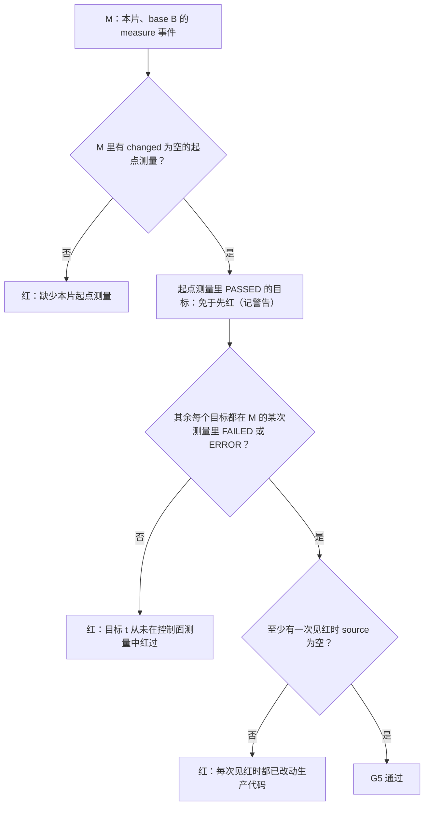
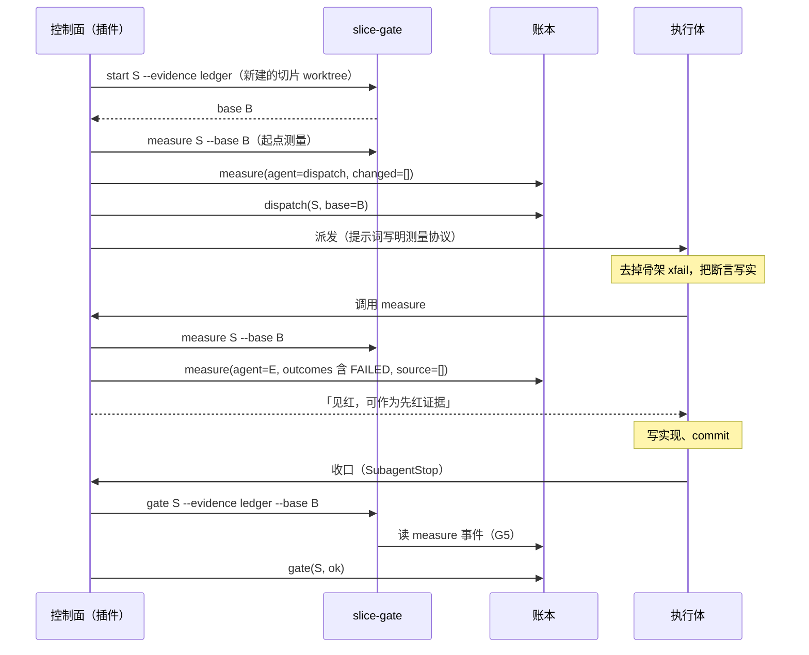
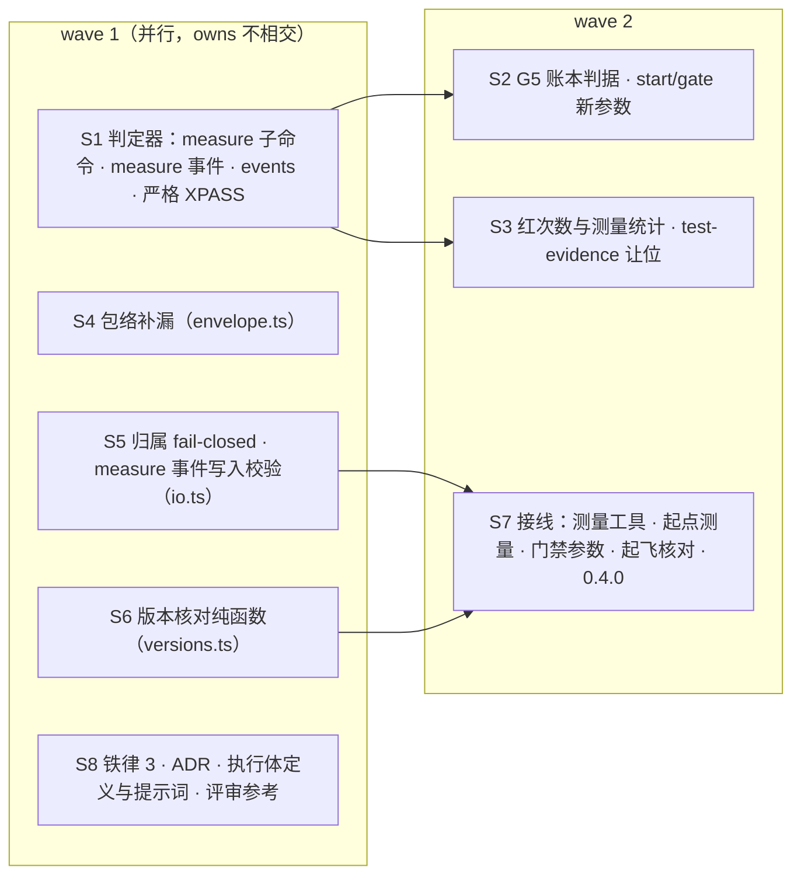

## Context

**现状**：插件接管飞行以后，RED / GREEN 留痕仍然靠 classic hook `test-evidence.py`。它写进执行体自己 worktree 里的 `evidence.log`，G5 读到的永远是「无 evidence.log」，只给警告。门禁的 base 读自切片标记 `.openspec-slice`，而这个标记同样在执行体可写的 worktree 里。

**已定的方向**：评审页 `docs/flight-orchestrator.html` 的 D3 选 A，「执行体请求、控制面执行」；路线页把它排在 3b-3。

**用户在本 change 规划时定的两点**（2026-10-10）：
- G5 账本判据不满足时**直接判红**，不设只警告的过渡版本；
- 起飞核对插件版本时，**读不到已安装记录就照常起飞并注明**，只有读到且确实不一致才拒飞。

**相关引擎事实**（类型定义 2.1.295）：
- `$.plugin.root` 是会话实际加载的插件目录。
- `$.env.get` 只接受字符串字面量。
- 插件注册的工具必须写进 agent 类型的工具白名单，被派发的 agent 才能调用（实测 X3），返回值必须是字符串。
- pytest 8.4.2 的严格 xfail 意外通过时，report 的 `outcome` 是 `failed`，`longrepr` 以 `[XPASS(strict)]` 开头，且没有 `wasxfail`。

## Goals / Non-Goals

**Goals**：
- 插件飞行中，「先红后绿」由控制面执行测试并写入账本，G5 只认账本。
- 门禁的 base 与证据模式由控制面给出，不读执行体可写的文件。
- 飞行记录的门禁红次数与账本一致。
- 插件与判定器的版本错位在起飞时被机械发现。
- #42 评审留下的包络缺口闭合。

**Non-Goals**：
- **删除 Workflow 引擎**：留给 3c。在那之前，`--engine=workflow` 回退路径的 G5 仍读 evidence.log，行为不变（铁律 10）。
- **非 pytest 目标**（比如下游直接映射到 `*.test.ts::name`）：无法测量，G5 只给警告。见天花板。
- **修复体（fixer）的先红证据**：修复体收口跑的是全量 final，不按 scenario 测量。
- **默认权限模式下对 `cd` 前缀判 ask 还是 deny**：仍待实测（#43 未覆盖）。

## Decisions

### D1 · 测量工具：执行体请求，控制面执行
- **注册**：插件在 `session.start` 注册工具 `measure`（与 `submit_findings` 同一处）。执行体类型的工具白名单加上 `mcp__flight__measure`。
- **调用方校验**：调用方必须是在飞飞行、当前 attempt、role 为 executor 的 agent，否则拒绝，理由「只有本次飞行的执行体可以请求测量」。
- **执行**：控制面在该执行体的 worktree 里运行
  `slice-gate.py measure <S> --change-dir <D> --base <B>`，其中 B 取该执行体 dispatch 事件里记的 base。
- **记账**：结果写成 `measure` 事件（D2），再把摘要作为工具结果返回给执行体。摘要包括：
  - 每个目标的状态；
  - 本次是否见红；
  - 如果见红时已经改了生产代码，明确说明这次红不能作为先红证据；
  - pytest 输出尾部。
- **失败处理**：测量没有完成（超时、输出不是 JSON），或者账本写不进去时，返回「测量没有完成：原因」，不记事件。
- **GREEN 不另设测量**：收口门禁的 G7 本来就由控制面实跑本片 scenario 测试，结论写在账本的 gate 事件里，这就是可信的 GREEN。路线页原文写的是「收口前再请求一次」，这里省掉，执行体少一轮，证据也不缺。
- **否决**：B 保留 test-evidence hook。它的问题是测试结果仍出自执行体的环境与时机，而且记录在执行体可写的地方。

### D2 · `measure` 事件与判定器
- **字段**：在公共字段之外，带 `attempt`、`slice`、`agent`（起点测量写 `dispatch`）、`base`、`commit`、`outcomes`、`changed`、`source`。
  - `outcomes` 是 `[目标, 状态]` 的数组，状态取 PASSED、FAILED、ERROR、SKIPPED、XFAIL、XPASS、MISSING 之一。
  - `changed` 是相对 base 的全部改动文件，含未提交的。
  - `source` 是其中的生产代码，分类与 G3 相同：非测试、非文档 / 配置、不在 change 目录内。
- **写入方与读取方同表校验**：插件 `io.ts` 的 `EVENTS` 与 `ledger.py` 的 `EVENTS` 用同一张字段表。
- **`ledger.py events`**：新子命令，每行打印一个已知事件类型，供起飞核对（D8）。
- **`slice-gate.py measure <S> --change-dir D [--base B]`**：
  - **运行范围**：只跑本片 scenario 映射里以 `.py` 结尾的目标，复用 G7 的 pytest 运行方式与超时。
  - **输出**：打印 JSON `{slice, base, commit, outcomes, unmeasurable, changed, source, tail}`。
  - **状态合并**：一个目标对应多个参数化节点时，按 ERROR > FAILED > XPASS > XFAIL > SKIPPED > PASSED 取最差的一个；没有任何结果记为 MISSING。
  - **退出码**：跑完退出 0，不论红绿。跑不起来或超时退出 1，JSON 里带 `error`。
- **严格 XPASS**：G7 用的 pytest 插件把 `outcome == failed` 且 `longrepr` 以 `[XPASS(strict)]` 开头的 report 记为 XPASS。G7 照旧只认 PASSED，所以 G7 的行为不变。测量里的 XPASS 不算红。

### D3 · 起点测量
- **何时测**：派发执行体之前，在 `slice-gate start` 成功之后，如果账本里还没有本片、本 base 的「起点测量」，控制面先测一次（agent 记为 `dispatch`）。起点测量指 `changed` 为空的测量。
- **测失败**：测量跑不起来或写不进账本 → 本片记 `blocked`（infra），理由「起点测量失败：原因」，不派发。
- **用途**：起点测量里已经 PASSED 的目标，免于先红。典型情况是 scenario 映射到已有测试。豁免依据是控制面亲自测出来的，规划者的声明不算数。
- **续接的情形**：续接时 worktree 里已有改动，测出来的 `changed` 不为空，不算起点测量。如果此前没有起点测量，G5 会判「缺少起点测量」。只有跨插件版本续飞时才会碰到，见风险。

### D4 · G5 账本判据（门禁带 `--evidence ledger`；用户定：不满足即判红）
记 M 为账本里本片、指定 base 的全部 `measure` 事件，不分 attempt；指定 base 默认是门禁的 base，`--measure-base` 可以覆盖。T 为本片 scenario 映射里以 `.py` 结尾的目标。

- **读不到账本** → 红，理由「账本读取失败」（fail-closed）。
- **非 `.py` 目标** → 警告「无法测量」。
- **账本模式下不读 evidence.log**：不出现 evidence.log 相关的警告，`hooks_missing` 为 false。
- **不带 `--evidence ledger`**（Workflow 回退路径、手工运行）：沿用 evidence.log 判据，一字不改。

### D5 · base 与证据模式由控制面给出
- **start**：`slice-gate start <S> --evidence ledger` 在切片标记里写 `"evidence": "ledger"`。控制面从 start 打印的 JSON 取 base，记进 dispatch 事件的 `base` 字段（表外字段，读取方允许）。
- **执行体的门禁**（收口、结束后补跑、续飞 regate）：一律带 `--evidence ledger --base <该执行体 dispatch 事件的 base>`。
- **解冲突 agent 的门禁**：带 `--evidence ledger --base <解冲突 dispatch 的 base> --measure-base <本片最后一个执行体 dispatch 的 base>`，沿用执行体那次的测量证据。
- **兼容旧账本**：dispatch 事件没有 `base`（账本由旧插件写入）时，门禁不带 `--base`，退回读标记。这只在跨版本续飞时出现，记作天花板。
- **执行体改标记的后果**：改了也不影响门禁区间与 G5。

### D6 · test-evidence 卸下飞行职责
切片标记的 `evidence` 为 `ledger` 时，`test-evidence.py` 直接返回，不写 evidence.log。其余情形不变：Workflow 回退路径、非飞行的 apply、没有标记时的分支名与唯一候选推断。evidence.log 仍在记录文件之列，供回退路径使用。

### D7 · 门禁红次数与测量统计从账本来
`timeline.py report` 能读到本 change 的账本且其中有 takeoff 时：
- `门禁红次数：N（账本：切片门禁 x · final y）`：x 是 `ok` 为 false 的 gate 事件数，y 是 `ok` 为 false 的 final 事件数，统计全部 attempt。
- 另起一行 `测量：n 次（见红 m 次）`。

没有账本时按 timeline 行统计，与现状一致。账本读取失败时也按 timeline 统计，并注明「账本读取失败」。插件落地打印的飞行记录取自同一个 `report`，`/pr-ship` 看到的也是同一个数。

### D8 · 起飞核对版本（新文件 `versions.ts`，纯函数，经 Io 读文件）
1. **加载版本**：读 `${$.plugin.root}/.claude-plugin/plugin.json` 的 `version`，读不到就写「未知」。
2. **已安装记录**：读 `<配置目录>/plugins/installed_plugins.json`。配置目录取 `CLAUDE_CONFIG_DIR`，没设就用 `$HOME/.claude`。
   - **选条目**：在键以 `flight@` 开头的条目里，先找 `scope` 为 project 且 `projectPath` 等于主 worktree 的，再找 `scope` 为 user 的。
3. **拒飞条件**：加载目录与选中条目的 `installPath` 都在 `<配置目录>/plugins/cache/` 下，并且两者不同。回复写明两边的版本与目录，提示「先运行 /reload-plugins 再起飞」，不写账本。
4. **未核对**（用户定）：文件不存在、JSON 坏了、找不到条目、加载目录不在缓存下（`--plugin-dir`、目录市场）→ 照常起飞，起飞回复注明「已安装版本未核对：原因」。
5. **判定器事件表**：起飞时运行 `python3 <判定器目录>/ledger.py events`。插件会写的事件类型里有它不认识的 → 拒飞，回复写明缺哪些，提示「先把主检出更新到与插件同一版本」。子命令不存在、退出码非 0 → 同样拒飞，提示判定器过旧。
6. **起飞回复**：`✈ 起飞 <change>：n 片 / k 个 wave · 主模型 <m> · 插件 <版本>[（已安装版本未核对：…）] · attempt <a>`。

### D9 · 包络补漏（#42 评审 MEDIUM）
- **解释器 `-c` 与 `eval`**：一段的程序名是 `bash`、`sh`、`zsh` 且带 `-c`（含 `-lc` 这类组合），或者程序名是 `eval` 时，取其后的命令文本，去掉一层引号，按同一套规则递归判定。递归时以这一段的当前目录作为起点。命令文本取不出来（例如引号不配对，这包括被分段切开的情形）→ 拒绝，理由「无法判定解释器 -c / eval 内的命令」。
- **换目录的写法**：
  - 判程序名之前，先剥掉段首的 `builtin`、`command`、`exec`，以及 `env` 和它的选项与 `VAR=`；
  - `pushd 
` 与 `cd 
` 一样设定目录；
  - `popd` 之后目录记为无法判定。
- **`GIT_*` 环境变量**：
  - 改动类 git 段的前导赋值（含经 `env` 给出的）里有以 `GIT_` 开头的键 → 拒绝；
  - `export` 段出现 `GIT_` 开头的名字 → 拒绝；
  - 只含赋值、且赋值键以 `GIT_` 开头的段 → 拒绝。
- **写共享 config 的子命令**：
  - `git remote` 只放行无参数、`-v` / `--verbose`、`show`、`get-url`，其余拒绝；
  - `git branch` 的拒绝选项加上 `-u`、`--set-upstream-to`、`--unset-upstream`、`--edit-description`；
  - `fetch` 进拒绝表。
- **Glob 不越界免询问**：Glob 的 `pattern` 是绝对路径或含 `..` 段时不升级。

### D10 · 归属判定 fail-closed
- **区分读失败**：扫描本进程登记的在飞飞行的账本时读取失败（`ledger.py` 退出码非 0），并且别处也没找到该 agent，归属查询返回「判不出」并带上原因，不写进未命中缓存。
  - **为什么只看在飞飞行**：其他 change 的账本读失败照旧跳过，一条损坏的旧账本不能让所有非飞行 agent 都判不出。
  - **`flightOfAgent` 对外不变**。
- **在飞期间判不出**：写入与 Bash 一律拒绝，理由「归属判定失败，稍后重试」；`tool.check` 不升级。与「登记中」同样处理。
- **登记中刻意不撤销**（否决 #42 评审 LOW 的「加撤销入口」）：dispatch 写入失败时，撤销登记会让该 agent 被当成非飞行 agent，不再受包络约束，这是 fail-open。让它一直停在登记中、写入被拒，才是安全的一侧。飞行停下后已派出的 agent 仍在跑，这个问题留给 3c 的 abort。

### D11 · 文档与铁律
- **铁律 3**（根 `CLAUDE.md` 与 `template/CLAUDE.md.snippet`）改为：
  > TDD 与留痕：生产代码前必有先失败的测试；测试由可信方运行并留痕（飞行中 = 控制面测量写入账本；回退路径 = hook 写 evidence.log），不接受自述。
- **新 ADR** `DRAFT-flight-measure-protocol`：
  - `Status: accepted`；
  - 写明细化 `DRAFT-gate-evidence-not-self-reported` 第 1 条，真值源加入账本的 measure 事件；
  - 飞行路径取代 `DRAFT-apply-as-flight` 第 4 条中「测试运行由 hook 留痕」一句。两份旧 ADR 原文不动。
- **执行体**：
  - 定义加上工具 `mcp__flight__measure`，并写明协议：先去掉骨架标记、把断言写实 → 调 measure 看它红 → 再写实现；
  - 删掉「不加 `cd && ` 前缀」与「测试运行由 hook 自动留痕」两句；
  - 派发提示词同样写明协议。
- **评审参考材料**（`pr-ship.md`、`code-reviewer.md`、`README.md`、`docs/WORKFLOW_zh.md`）：飞行模式看账本（`timeline.py report` 的测量统计与 gate-report），evidence.log 只属于回退路径。

### D12 · 版本
插件升到 0.4.0：新增工具与新事件类型，判定器需要同版本。

### 一个切片的时序（测量协议上线后）

### 切片与 wave

## Risks / Trade-offs

- **G5 判红的摩擦**：执行体如果先写了实现才去测量，就再也拿不到合格的先红证据，3 次收口红后本片记阻断，交给人处理。
  - **缓解**：提示词、agent 定义和测量结果三处都写明协议，测量结果当场指出「这次红不算先红」。
  - **为什么接受**：这正是铁律 3 要拦的情形，用户已定直接判红。
- **跨版本续飞**：旧插件写的账本里没有 dispatch base，也没有起点测量。在 0.4.0 上续飞这类飞行，G5 会判「缺少起点测量」。处理办法是作废重飞。合入时没有在飞的飞行，影响面为零。
- **测量增加耗时**：每片多一次起点测量，执行体每测一次要等一次 pytest，等待时间与本片 scenario 测试的规模相当，通常是秒级。
- **`installed_plugins.json` 没有文档**：格式一变就只能注明未核对，不会误拒（D8 第 4 条）。
- **本 change 自身的飞行**：跑在 0.3.2 上，测量协议尚未生效。G5 仍是旧的警告语义，这是自举的必然。
- **天花板**：
  - 非 pytest 目标无法测量；
  - 包络递归判定不做真正的 shell 词法分析，宁可多拒；
  - dispatch 没有 base 时退回读标记。

## Migration Plan

合入后必须做两件事，缺一件起飞就会被拒，并提示缺哪一步：
1. 主检出快进到合入提交。判定器读的是主检出里的副本。
2. 更新插件并 `/reload-plugins`：`claude plugin marketplace update intent-driven && claude plugin update flight@intent-driven`，确认起飞回复显示插件 0.4.0。

合入后的下一次飞行，就是测量协议的首飞。

## Open Questions

无。两处取舍已由用户定（见 Context）。
