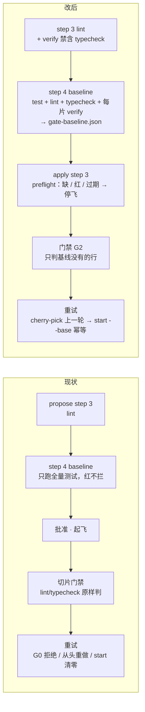

# 设计 · 起飞前预检、门禁基线差分、重试接续、evidence 定位

**触发器命中**：改公共契约（新文件 `gate-baseline.json`、新子命令 `preflight`、`gate` JSON 新字段、`start --base`）+ 跨模块（hooks / workflow / agents / commands / skills / schema）→ 写实质设计。审批页与证据：`docs/flight-preflight-and-retry.html`。

## Context

飞行模式现有判据全部在**起飞后**才对环境事实说话：baseline 只跑全量测试且退出码只是提示；切片门禁对 lint / typecheck 原样执行；verify 命令是否可运行要等执行体第一次跑才知道。重试语义又把「上一轮」当作不存在：不隔离时 G0 拒绝自己的 commit，隔离时从头重做，重跑 `start` 还把区间与红计数一起清零。evidence hook 在没有标记的窗口里靠猜定位 change。



## Goals / Non-Goals

**Goals**

- 把「环境坏 / 命令不可运行 / 既有错误」的判定移到人类批准之前，且判据是脚本。
- 切片门禁与 final 对 lint / typecheck 只为**本 change 新引入**的问题变红。
- 重试在两种隔离模式下都接着上一轮的 commit 与基准继续，红计数累加。
- evidence 写入目标要么确定，要么不写。
- pr-ship 自动修代码之前经人类同意一次。

**Non-Goals**

- 不判 lint 的**范围**（不注入 `SLICE_FILES`，用户 D2 选「仅基线差分」）；lint 命令仍由作者按项目习惯写。
- 不加「已知红，放行」字段：那是模型自证。基线红只能改 `gate.test` / verify / 环境，改计划文件即触发 takeoff-gate 重批。
- 不改 `takeoff-gate.py`、`stop-gate.py`、G1 / G3–G8 语义。
- 不修 `TEST_RE` 被命令文本误触发（记录）。

## Decisions

### D1 预检落在 `baseline` + `preflight`，不落 takeoff-gate

| 候选 | 判断 |
|---|---|
| 扩 `takeoff-gate.py` | 它只读转录判人类批准，混入环境判定会让「批准不成立」与「环境坏」共用一个退出码，收口报告分不清 |
| 扩 `lint` 子命令 | propose step 3 在 baseline 之前跑 lint，此时基线必然不存在；且既有测试与文档都锚定 `slice-gate.py lint` 的文本 |
| **新子命令 `preflight`** | 语义单一：规划合法 ∧ 基线新鲜且绿。apply step 3 `lint` 之后加一行。选它 |

`preflight` 判据（任一不满足 → stderr 点名、exit 2）：`lint_plan` 无错；`gate-baseline.json` 存在；`ok == true`；`plan_sha` 等于当前 `sha1(json.dumps([gate.test, gate.lint, gate.typecheck, [[id, verify]...]], ensure_ascii=False, sort_keys=True))`；`git merge-base --is-ancestor <commit> HEAD` 成立。通过则打印 waves JSON（与 `lint` 同形）。

### D2 `gate-baseline.json` 是生成物，不是飞行记录

```json
{
  "commit": "<40 位 sha>", "at": "<ISO>", "plan_sha": "<40 位 sha1>",
  "ok": true, "reasons": [],
  "test": {"exit": 0, "sec": 9.6},
  "lint": {"exit": 0, "lines": []},            // 未配置 → null
  "typecheck": null,
  "verify": {"S1": {"exit": 0}, "S2": {"exit": 0}}
}
```

- 由 propose step 4 产出，随工件一起提交；`FLIGHT_RECORDS` 不变，执行体提交它不会被 G6 flight-record 拦（它不会变，也没理由提交）。
- `ok` = `test.exit == 0` ∧ 所有 `verify[*].exit == 0`。lint / typecheck 红**不影响 ok**，只记基线行。
- `reasons` 形状：`全量测试在基线上红（exit N）` · `S3 verify 在基线上红（exit N）：命令不可运行或含既有错误`。
- 仍保留 `slices.json.gate.full_suite_sec` 的写回（既有契约）。`plan_sha` 在写回之后计算。

### D3 差分规范化：数字串折叠，行集比较

`normalize(line)`：去 ANSI（`\x1b\[[0-9;]*[A-Za-z]`）→ 连续数字替换为 `#` → strip → 空行丢弃。新增行 = `set(norm(本次)) − set(norm(基线))`。

| 候选 | 判断 |
|---|---|
| 原文行比较 | typecheck 报错带行列号，切片一改文件就漂移，既有错误全部变「新增」 |
| 只比较 exit 码 | 基线红后本 change 引入的新错误永远看不见 |
| **数字折叠 + 行集** | 同文件同报错视为既有；rustfmt diff 的上下文行含数字也能对上。误判方向是「少报」，由 final 与 CI 兜底 |

判定：`rc == 0` → 无事；`rc != 0` 且无基线 → 红（现行为）；有基线且新增行为空 → `warnings` 追加 `G2 <kind>: exit N，输出与基线一致（既有 K 行已按基线排除）`；新增行非空 → `failed` 追加 `G2 <kind>: exit N（新增 M 行）` + 前 6 条新增行。`run_cmd` 保持只返回尾 6 行，另加 `run_cmd_full` 返回完整输出供差分。

### D4 重试用 cherry-pick 接续，不改派发方式

已核实 Workflow `agent()` 只有 `isolation: 'worktree'`，没有复用 worktree / 指定 cwd 的选项。worktree 共享对象库，上一轮 commit 的 sha 在门禁 JSON 里（`commit`），两种模式统一为：

```
第零步（仅重试）：git rev-parse HEAD ≠ <retryOf.commit>
  → git cherry-pick <retryOf.commit>；冲突 → git cherry-pick --abort，返回 {"ok":false,"failed":["G0 base: cherry-pick <sha> 冲突"]}
第一步：python3 .claude/hooks/slice-gate.py start <S> --base <retryOf.base>
```

不隔离：HEAD 已是该 commit，跳过 cherry-pick；`start` 发现同片标记 → 保留 base / red_count。隔离：新 worktree 从 change 分支 HEAD 分叉（wave 内 integrator 尚未合回，与上一轮同一起点），cherry-pick 后 `--base` 钉回原始基准，区间完整。首轮 prompt 仍用 `expectHead` 校验。`retryOf.base` 来自 `gate` JSON 新字段 `base`（GATE schema 声明为可选 string；旧执行体不带它时回退为不传 `--base`）。

### D5 evidence 定位：三级，宁缺毋错

标记 → 分支名 `worktree-<name>`（`openspec-git-discipline` 的命名约定）且 `openspec/changes/<name>` 存在 → tasks.md 有未勾选项的 change **恰好一个** → 否则 `(None, None)`。原回退「第一个候选」在多活跃 change 仓库里几乎必错；单候选保留，兼容单 change 仓库。

### D6 pr-ship 的一次问询前移到自动修复之前

`test_pr_ship_single_review` 锁「问询 ≤ 1」。step 10：有 CRITICAL/HIGH → `AskUserQuestion`（自动修并 push / 只贴评论交人），无人应答或选后者 → 只贴评论、`review-findings.json.blocking` 保留、ship 照常裁 draft。step 11 不再问。Guardrail 改为「全程至多问询 1 次（仅 step 10 自动修复前）」。

## Risks / Trade-offs

- **预检时间**：每片 verify 多跑一次。verify 本就是「本片判定命令」，应当秒级到分钟级；全量测试已在跑。可接受。
- **基线上 verify 红的合法场景**：作者故意写会红的 verify（非 strict-xfail 骨架）。schema 已要求 strict-xfail；这类 verify 本就违反契约，预检拦下是正确行为。
- **数字折叠误合并**：两条只差数字的真新错误会被当既有。final 与 CI 兜底；差分只在门禁层减少误报。
- **cherry-pick 冲突**：仅当 wave 内 change 分支在两轮之间移动；工作流不会这样做，冲突即 G0 停下。

## Migration Plan

无数据迁移。旧 change 没有 `gate-baseline.json` → `preflight` 会要求先跑 `baseline`；门禁在无基线时行为不变。

## Open Questions

- `TEST_RE` 误触发（sed / grep 文本含 `cargo test`）：观察判据——再出现一次写错行就立 change 改为只匹配命令首词。
- 预检是否要提示 verify 依赖未纳入 git 的目录（node_modules）：等隔离 worktree 再因此红一次再做。
