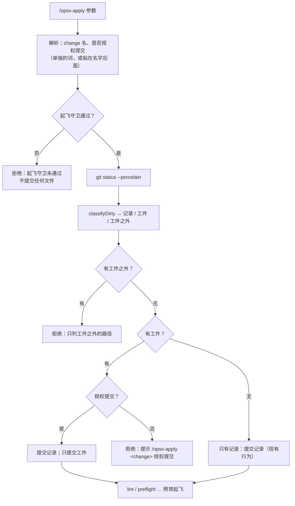

## Context

触发器命中：插件代人提交文件，属于安全边界（git 写操作的授权范围）。动机见 proposal。

现状（读码核实，main @ `6eadf6e`）：
- `orchestrator.tsx` 的 `takeoff()` 依次检查：版本 → 定位 → 起飞守卫（`takeoff-gate.py`，比对账本批准与计划指纹）→ git 版本 → 工作区 → lint / preflight → 主模型 → 账本。
- 工作区那一步：`git status --porcelain --untracked-files=all`，未提交的全是 `RECORD_FILES`（change 目录下的记录文件）时，`commitRecords` 提交「chore(flight): 记录」；否则拒绝，并列出全部 porcelain 行。
- 参数：`argsOf` 按空白切分，change 名取第一个不以 `--` 开头的词，其余词被忽略。
- 计划指纹（`plan_fp.py`）只读文件内容，提交不改变指纹，批准仍然有效。

图（c4-diagrams：目的 = 现有代码的设计评审；格式 = 普通 Mermaid flowchart；严格度 = 轻量，作为假设记录）。起飞时工作区判定的动态视图：

图说明：
- **边界**：分类是纯函数（`land.ts`），可以单测；提交只在 `takeoff()` 里、起飞守卫之后发生。
- **信任**：「授权提交」是人写在命令里的文字，插件执行提交，模型不参与；起飞守卫保证只对已批准的计划生效。
- **假设**：git 对含非 ASCII 字符的路径会加引号转义（`core.quotepath`），这类路径归为工件之外（fail-closed）。

## Goals / Non-Goals

**Goals**：人写「授权提交」后，一条命令完成「提交工件 + 起飞」；授权范围由规则判定，只覆盖本 change 的工件。

**Non-Goals**：
- 不带「授权提交」时自动提交：不做。提交是写操作，要人明确授权。
- 改批准带的预填文本（`register.tsx`）：不做，仍预填 `/opsx-apply <change>`。propose 的交接文字告诉人可以追加「授权提交」。
- 旧 Workflow 引擎：不改，3c 删除。

## Decisions

### D1 · 授权词与解析
- **识别**：参数里有一个词恰为「授权提交」；或者 change 名候选以「授权提交」结尾、去掉后缀后非空，此时去掉后缀作为 change 名。
- **只认这一个词**：不加英文别名，按 proposal 的实测用法。
- **否决**：用 `--commit` 之类的旗标（人实际写的就是「授权提交」）；不加任何词也自动提交（提交是写操作，需要明确授权）。

### D2 · 工件的机械分类（`land.ts`：`classifyDirty`）
- **签名**：`classifyDirty(paths, { changeDir, scenarioFiles }) → { records, artifacts, others }`，纯函数。
- **records**：`RECORD_FILES` 映射到 change 目录下的路径。
- **artifacts**（全部满足其一）：
  - 以 `${changeDir}/` 开头、且不是 records；
  - 位于 `${openspec 根}/adr/`，文件名以 `DRAFT-` 开头、以 `.md` 结尾。openspec 根 = `changeDir` 去掉末尾 `/changes/<name>`；
  - 在 `scenarioFiles` 里（来自 `slices.json` 的 `scenario_tests`，取 `::` 之前的部分，去重）。
- **others**：其余全部，包括已编号 ADR（ADR 不可改，只能 supersede）以及 porcelain 的改名行（`a -> b`）。
- **否决**：
  - 按切片 owns 判定（owns 是实现文件，起飞前本不该有改动）；
  - 由模型列清单（铁律 9：能用脚本判定的不交给模型）。

### D3 · 提交（`land.ts`：`commitArtifacts`）
- **做法**：`git -C <tree> add -- <绝对路径…>`，再 `git -C <tree> commit -m "docs(openspec): <change> 工件（起飞时经「授权提交」提交）" -- <绝对路径…>`。
- **只提交列出的路径**：用 pathspec 限定，暂存区里别的东西不会被带进提交。
- **顺序**：先用现有 `commitRecords` 提交记录（如有），再提交工件，都在 lint / preflight 之前；之后的检查看到的是干净工作区。
- **回复**：起飞回复追加一行「已提交工件 N 个文件」。

### D4 · 拒绝信息
- **有工件之外的改动**：「flight：工作区不干净，不起飞（工件之外的未提交改动）：」，后接这些路径，每行一个。不列工件，免得人误以为工件也要手动处理。
- **只有工件、但没授权**：「flight：工作区不干净，不起飞：未提交的只有本 change 的工件（N 个）。确认无误后发 `/opsx-apply <change> 授权提交`，插件只提交这些文件后起飞」。

### D5 · 插件补丁版本 +1
`plugin.json` 的 version 在执行时 worktree 里的当前值上升一个补丁号，不写死。

## Risks / Trade-offs

- [scenario 测试文件里混进了与本 change 无关的改动] → 这些文件本来就是工件的一部分（tasks 阶段写的骨架），人审批时看过；授权只扩大到这几个文件，不扩大到目录。
- [git 对非 ASCII 路径加引号] → 归为工件之外并拒绝（fail-closed）；人手动提交即可。本仓库与 afa 的工件路径都是 ASCII。
- [与 `flight-measure` 同改 `orchestrator.tsx` 的 `takeoff()`、与 `flight-gate-speedup` 同改 propose 文档] → 人已选定在 `flight-measure` 合入后起飞；起飞前预合并 main、解决文本冲突、重跑 baseline。计划文件不变则指纹不变，否则重新渲染审批页并重新批准。

## Migration Plan

合入后：`claude plugin update` → `/reload-plugins`，确认插件版本为本 change 升出的版本。不需要数据迁移；回滚即回退提交。

## Open Questions

无。
