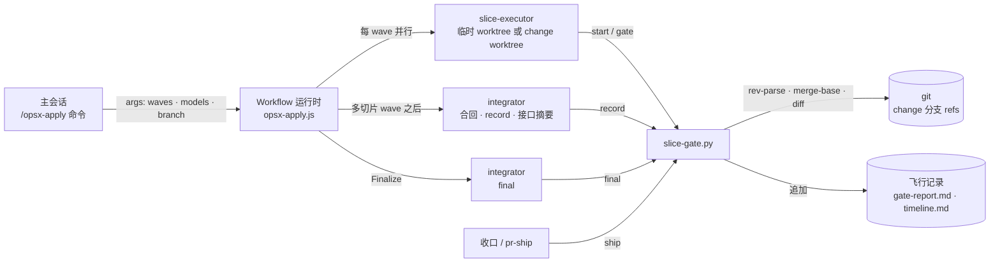
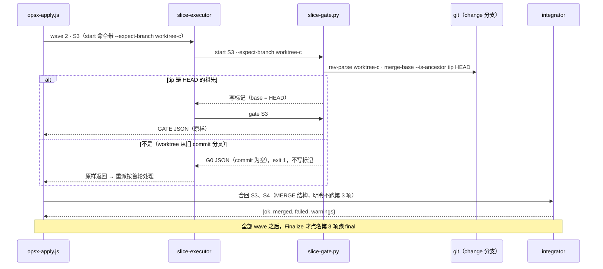

# 设计 · 飞行多 wave 缺陷：基点校验、合回契约、final 新鲜度、取 diff 回退、.flight 忽略

**触发器命中**：跨模块（hooks / workflow / agents / commands / skills / install.sh）+ 改公共契约（`start --expect-branch`、工作流参数 `expectHead → branch`、合回返回结构、`ship` 新鲜度判据）→ 写实质设计。决策页与证据：`docs/flight-wave-fixes.html`（2026-09-24，用户选全部推荐项）。

**ADR**：不新增。A 是 `DRAFT-gate-evidence-not-self-reported`（判据只认 git / 文件系统 / 转录 / hook）的直接应用；B、D 是 `DRAFT-apply-as-flight`「调度用确定性脚本 · 评判用机械门禁 · 收口跑全量门禁」下的契约细化，不改变任何在役 ADR 的决定。

**图示约定（c4-diagrams）**：用途 = 对现有代码的变更设计；格式 = 普通 Mermaid（flowchart / sequenceDiagram）；严格度 = 轻量 C4 风格，只画一张容器图与一张动态图。三项按用户「都按推荐」的指示作为假设，未单独问询。

## Context

飞行由主会话（`/opsx-apply`）启动命名工作流 `opsx-apply.js`：脚本按 wave 派发执行体（多切片 wave 各开临时 worktree），wave 后派 integrator 合回，评审离关键路径，收口由 integrator 跑 final；`slice-gate.py` 承载全部机械判据；`ship` 在收口与 pr-ship 里裁 draft / ready。



- **A 出在 E→G→R**：现在的 G0 由执行体（模型）拿起飞时传入的 `expectHead` 比对 HEAD；R 每个 wave 合回后都前进，比对值却不动。现行重试分支根本不再校验基点。
- **B 出在 I**：合回派发要求 GATE 形状（`slice / commit / failed`），integrator 按定义第 3 项自跑 final 来填这些字段。
- **D 出在 S→G**：`ship` 要求 final 行 commit 等于 HEAD，而收口顺序是 final → 勾 tasks.md → 写 review-findings.json → 提交飞行记录。

## Goals / Non-Goals

**Goals**

- 基点校验的真值来自 git 里分支的实时位置，由脚本判定；首轮、重试、单切片 wave、多切片 wave 语义一致。
- wave 合回的结论只反映合回本身；全量门禁只在 Finalize 跑。
- 只动记账文件的 commit 不让 final 失效；其余任何改动仍让它失效。
- 评审拿不到 diff 时回退本地 diff，仍拿不到就如实报告失败，绝不报告「无变更」。
- `.flight` 在新装与已装项目里都不作为未跟踪文件出现。

**Non-Goals**

- 不修 C / E / J / G / L（见 proposal「不改」）。
- 不做 wave 级全量检查（`final --slices`，决策页 Q5 ② 未选）。
- 不把合回整段脚本化（更彻底的方向，留 backlog）。
- 不改重试接续（cherry-pick + `--base`）与 G1–G8 语义。

## Decisions

### D1 G0 挪进 `start`，判「分支 tip 是 HEAD 的祖先」

| 候选 | 比对值来源 | 谁判定 | 放进 stc 那次飞行 |
|---|---|---|---|
| ① 脚本维护 currentHead（取 integrator / gate 返回的 commit） | 模型自报 | 执行体 | w2 报 `6bc66a7`，实际 tip `f1e6b95` → wave 3 仍误红 |
| ② 执行体在 prompt 里比对 `git rev-parse <branch>` | git | 执行体 | 通过，但比对仍由模型做 |
| **③ `start --expect-branch <branch>` 祖先校验** | git | `slice-gate.py` | 通过；零 token；失败即关 |

契约：

```
start S --change-dir DIR [--base REF] [--expect-branch BRANCH]
  给了 --expect-branch 时，先于一切（含同片 resume）：
    tip = git rev-parse --verify BRANCH^{commit}      失败 → G0「分支 BRANCH 不存在」
    git merge-base --is-ancestor tip HEAD              否   → G0「HEAD 不是分支 BRANCH（tip）的后代」
  G0：stdout 打印 {"slice": S, "ok": false, "commit": "", "failed": ["G0 base: …"], "warnings": [], "summary": "…"}
      exit 1；不写标记、不记 timeline
  通过：与现有 start 完全一致（同片 resume / 新标记，base = --base 或 HEAD）
```

- **祖先而非相等**：重试会先 cherry-pick 上一轮 commit，HEAD 比 tip 多一个 commit，相等比较在这里会误判；首轮 HEAD 等于 tip 时祖先关系同样成立。
- **单切片 wave**：执行体就在 change worktree 里，HEAD 即 tip，自然通过（#32 的 S3 正是被旧比对误判的这种情况）。
- **失败即关**：不写标记 → 之后的 `gate` 因「没有 base」退出非 0，产不出任何绿结论，不依赖执行体是否照做。
- **`commit` 置空串**：G0 的上一轮没有产出。脚本重派时 `retryOf.commit` 为空 → 走首轮分支，不 cherry-pick。现行 G0 JSON 填的是「实际 HEAD」，基点真错时重试会把一个无关 commit 接进来。
- **重试同样校验**：重派的 start 也带 `--expect-branch`（现行重试分支不做任何基点校验）。
- **退出码 1**：与 gate 红同义（判定为红），区别于参数错误的 2。

脚本侧：`const branch = args.branch || null`；`startCmd(s, base)` 在 `branch` 非空时追加 ` --expect-branch ${branch}`；首轮 prompt 删去第零步的 `expectHead` 比对，在 start 那一行之后写明「start 非 0 → 不做任何改动，把它打印的 JSON 原样作为最终输出」；`args.expectHead` 退役（脚本全文不再出现）。`branch` 由 apply 命令 step 5 在 change worktree 里用 `git branch --show-current` 取得。

### D2 合回用独立返回结构，明令不跑 final

```js
const MERGE = {
  type: 'object',
  required: ['ok', 'failed'],
  properties: {
    ok: { type: 'boolean' },        // 只表示合回与 record 是否成功
    merged: { type: 'array', items: { type: 'string' } },
    failed: { type: 'array', items: { type: 'string' } },
    warnings: { type: 'array', items: { type: 'string' } },
  },
}
```

- 合回 prompt 末尾加：「本次只合回，不要运行第 3 项（全量门禁 final）——后续 wave 的 scenario 还没解锁，现在跑必然红。返回 JSON {ok, merged, failed, warnings}。」
- `integrator.md` 第 3 项首句改为「仅当 prompt 点名第 3 项时运行（Finalize 会点名；wave 合回不点名，也不要自己跑）」，命令本身不变。
- `integ.ok` 为 false 的含义收窄为「合回冲突 / record 失败 / 未返回」；`blocked` 条目形状不变（`{slice: 'wave<i>', kind: 'infra'}`）。

| 候选 | 取舍 |
|---|---|
| **① 独立返回结构 + 明令不跑** | 结构本身不再诱导 integrator 去填门禁字段；选它 |
| ② ① + 每 wave `final --slices <已完成>` | 每 wave 多一次全量测试；Fix 本就在所有 wave 之后，早知道也改变不了决策 |
| ③ 只改 prompt | GATE 的 `slice / commit / failed` 仍在；stc 三个 wave 三种返回形状就是这么来的 |

### D3 final 新鲜度：记账文件白名单

`cmd_ship` 在 `final["commit"] != head[:10]` 时再判一次：

```
fresh = git merge-base --is-ancestor <final> HEAD 成立
        且 git diff --name-only <final> HEAD 的每一项都是 <change_rel>/ 下的
           timeline.md · gate-report.md · evidence.log · review-findings.json · tasks.md 之一
任一 git 命令失败（例如记录的 commit 不存在）→ 不新鲜
不新鲜 → reasons 照旧追加「final 过期：记录 X，HEAD Y」（文案不变）
```

- **白名单依据**：stc 的 `3be9fd9..8fa0e50`（evidence.log · gate-report.md · review-findings.json · tasks.md · timeline.md）与 `8fa0e50..ac2158d`（gate-report.md · review-findings.json · timeline.md）实际改动都是它的子集；本仓 #32 的两次「final 过期」同理。
- **边界**：`slices.json`、`specs/`、`slices/*.md`、源码、测试任何一个改过都判过期——计划或代码变了，final 的结论就不再适用。
- **`tasks.md` 算记账**：它由 `slices.json` 生成，飞行中只被勾选；takeoff-gate 的新鲜度规则已把「勾选」判为执行记账（`tests/test_approval_gate.py`），两处口径一致。

### D4 取 diff：为空、拉不到、都拉不到三分

| 情况 | 行为 |
|---|---|
| diff 确实为空 | 报告「无变更」并停止（不变） |
| `gh pr diff` / `glab mr diff` 失败（如 HTTP 406 diff 过大） | `git fetch origin <target>` 后 `git diff origin/<target>...HEAD` |
| 两种都拉不到 | 报告「取 diff 失败」并停止；不得报告「无变更」 |

`pr-ship.md` step 8 的评审 prompt 与 `code-reviewer.md` 评审流程第 2 条同改。三点 diff 相对 merge-base，与 PR diff 同义。

### D5 `.flight` 忽略：模板 + 升级补行

- `template/openspec/.gitignore` 追加注释行与 `changes/*/.flight`（相对 `openspec/`，新装即生效；本仓 `template/openspec/changes/*/.flight` 同样被它覆盖）。
- `install.sh`：`copy_tree` openspec 之后，若 `$TARGET/openspec/.gitignore` 没有整行 `changes/*/.flight` 就追加（带注释），已有则 skip；install 与 `--upgrade` 都跑。理由：`install.sh:346` 对 openspec/ 从不覆盖，只改模板到不了 stc-foundation 这类已安装的仓库。

### D6 回退路径的 effort 文案

apply 命令 step 5 与 skill step 4 的回退段：Agent 派发只写 `subagent_type` / `model` / `isolation`，括注「Agent 工具没有 effort 参数，effort 由 agent frontmatter 决定：执行体 / 评审员 high，integrator low」。路由表的 effort 列保留——它描述各角色的 effort 水位，Workflow 路径由 `efforts` 传入。

## 一次多 wave 飞行（改后）



## Risks / Trade-offs

- [分支名传错] → 所有 start 都 G0、所有切片 blocked，但失败即关，原因在 JSON 里点名分支；apply 命令从 change worktree 的 `git branch --show-current` 取值，不手填。
- [旧调用方仍传 `expectHead`] → 脚本不再读它，等于不做基点校验（与旧版不传 expectHead 时一致）；唯一调用方 apply 命令 / skill 同 PR 同改，下游经 `install.sh --upgrade` 一并刷新。
- [白名单过宽] → 只放 5 个记账文件，计划 / 规格 / 代码任何改动照旧判过期；两条守卫测试锁住边界。
- [白名单漏项] → 以后新增记账文件时 ship 会多判一次「过期」，只是多跑一次 final，方向安全。
- [integrator 仍自跑 final] → prompt 明令 + 定义第 3 项加条件；即便它仍跑，MERGE 结构里也没有门禁字段可填，`integ.ok` 不再被 final 结论带偏，残留只是一行 timeline 噪音。
- [install.sh 测试的环境依赖] → 用 PATH 桩代替 openspec CLI，真实跑一次安装与两次升级，耗时秒级。

## Migration Plan

- 本仓 PR 合并后，下游跑 `./install.sh --upgrade <repo>`：`.claude/` 刷新（工作流、agents、命令、skill、hooks），`openspec/.gitignore` 补行。
- 进行中的 change 不受影响：`start` 不带 `--expect-branch` 时行为完全不变；旧计划文件无需改。
- 回退：revert 本 PR；`start` 的新参数可选，旧工作流不传就不生效。

## Open Questions

- **规格归档顺序**：flight-preflight-and-retry（未归档）的 `slice-retry-resume` 写着「首轮派发仍以 `expectHead` 校验基分支」，与本 change 的 `slice-base-check` 冲突。两者都还没进 `openspec/specs/`；归档时由归档人把那一句改为指向 `slice-base-check`（或本 change 归档时补一份 MODIFIED delta）。
- **后续 change**：C（续跑语义：切片包哈希进 prompt，fix / final 的 prompt 也可能不变而命中旧缓存）、E（owns 外旧测试断言 owns 内文件：可用信号是「verify 跑的测试不在 owns 里」）、J（注入段 6500 B，预算 4608 B）。
- **L（观察）**：`takeoff-gate.py` 只凭 `args.changeDir` 识别起飞；参数不是含 changeDir 的对象时会放行，但脚本随即因 models 缺失抛错、不派发。再出现一次真实误用再立 change。
