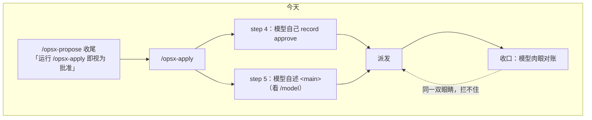
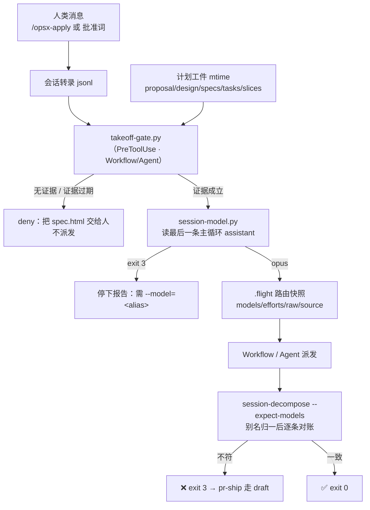

# 设计 · 起飞前两条判据的机械化

**触发器命中**：改公共契约（`/opsx-apply`·`/opsx-propose`·`/pr-ship` 的协议、`.flight` 结构、`session-decompose` CLI、新增 PreToolUse hook）+ 跨模块（hooks / commands / skills / docs）→ 写实质设计。

## 病灶：判据由被门禁的一方提供



两处判据（人批准了吗 · 主模型是什么）都来自模型自己的叙述：模型在同一轮里 propose → apply 也会留下一条 `approve`；上下文里旧的 `/model` 痕迹会让 `<main>` 停在几小时前的模型上。

## 目标态：判据来自转录与文件系统，hook 强制



## 决策 · 主模型判定

### D1 判定来源：读转录，不读模型的自我认知

| 候选 | 判断 |
|---|---|
| A 模型自述（现状"看 `/model`"） | **已证伪**：2026-09-10 那次会话，模型的依据是 05:25 的 `/model` 输出与两次 compact 后的摘要，而实际主模型 08:19 起已是 Opus |
| B 靠 `model: inherit` 兜底（frontmatter 或派发传 `inherit`） | **不可依赖**：本机 2.1.267 的 Agent 工具 `model` 取值域实测为 `sonnet\|opus\|haiku\|fable`，无 `inherit`；且 2026-09-10 wave 3 实测，frontmatter 已是 `model: inherit` 的 `slice-executor` 在派发未显式传 `model` 时仍全落 Sonnet。与铁律 11「不留空」也冲突 |
| **C 读会话转录（采用）** | 主转录每条 `type: "assistant"` 带 `message.model`；两份真实转录实测该字段稳定存在 |

**"最后一条"即当前主模型**：两份真实转录里 assistant 条目的 `isSidechain` 恒 `false`（子 agent 转录另存 `<sid>/subagents/`），主转录只含主循环；转录随轮次追加，step 5 运行时当轮条目已落盘（本会话实测运行中即可读到当轮 `claude-opus-5`）。实现仍显式跳过 `isSidechain: true`，防未来格式合并。

### D2 定位转录：环境变量 + glob，不推 slug

`CLAUDE_CODE_SESSION_ID` 实测存在于 Bash 工具环境（本机 2.1.267）。用它 glob `~/.claude/projects/*/<sid>.jsonl`，**不按 cwd 推 slug**：飞行在 worktree 里跑（slug 随 cwd 变），且 slug 是 `/`→`-` 的正向不可逆映射。`--session PATH` 覆盖供测试与异常兜底。定位函数 `find_transcript()` 与别名函数 `alias_of()` 是本文件的公开接口，S2 / S4 复用。

### D3 别名映射：子串归一，不认识就不猜

`claude-opus-5` / `claude-opus-5[1m]` → `opus`；sonnet / haiku / fable 同理。`[1m]` 变体归基座别名（子 agent 派发别名不带变体）。第三方 id（实测 `k3`）→ 不映射，非 0 退出。

### D4 fail-closed（与 intent-gate 相反）

`intent-gate.py` 是 fail-open（坏门禁不能锁死编辑能力）；本脚本相反：判定不出就停飞。"猜一个默认值"正是要消灭的故障模式，静默错配的代价（整场飞行跑错模型）远高于停下问一句。

### D5 对账口径：比别名，不比原始 id

主会话可能是 `claude-opus-5[1m]`，其子 agent 实测是 `claude-opus-5`。故 `.flight` 存**别名**路由表（附原始 id 与来源仅供留痕），对账时把各 agent 实际 id 归一成别名再比。阶段→角色：`Implement`/`Fix`→executor · `Review`→reviewer · `Finalize`→integrator。

### D6 复用 `alias_of`：importlib 按路径加载

hooks 文件名含连字符不能直接 `import`；`session-decompose.py` 以 `importlib.util.spec_from_file_location` 按同目录路径加载 `session-model.py`（`tests/conftest.py` 已有同款写法）。加载失败 → warn 一行退化为只打印，不阻断收口。

## 决策 · 起飞批准

### D7 批准证据来源：转录里的**人类消息**

| 候选 | 判断 |
|---|---|
| A 模型自己 `record approve`（现状） | 自证，无效 |
| B `UserPromptSubmit` hook 写批准 marker | 有状态：必须那一刻 hook 已装好才留得下痕，事后无法回溯；且让 `intent-reminder` 背上不相干职责 |
| **C 读转录里的人类消息（采用）** | 与 D1 同一份真值源、同一个定位函数；无状态、可回溯、可测（喂 fixture 即可） |

**人类消息**判据：`type == "user"` 且 `isMeta` 非真、`userType == "external"`、内容是文本而非 `tool_result`。命令调用在转录里形如 `<command-name>/opsx-apply</command-name>`，可精确识别；纯文本批准词（`批准`·`起飞`·`授权`·`approve`·`go`）作为补充令牌，覆盖"停下后人说一句起飞"的真实流程（2026-09-10 那次会话实测出现过 `授权` / `不相等，起飞`）。

### D8 新鲜度锚点：计划工件的 mtime

批准必须**晚于计划工件最后一次改动**（`proposal.md` · `design.md` · `tasks.md` · `slices.json` · `specs/**/spec.md` 的最大 mtime），否则"改完计划再拿旧批准起飞"就能绕过。

- 不用 git commit 时间：真实流程里工件常在人说完 `/opsx-apply` 之后才被 artifacts-only commit，用 commit 时间会**误判**（批准早于 commit）。
- 已知局限：`git checkout` / 重建 worktree 会刷新 mtime → 需要人再批准一次。方向是 fail-closed，可接受；命令的 deny 文案里写清楚怎么办。

### D9 强制点：PreToolUse hook（模型绕不过）+ 命令内显式调用（给人看的理由）

hook `takeoff-gate.py` 匹配 `Workflow|Agent|Task`，只在 `tool_input` 里出现 `openspec/changes/<name>`（Workflow 的 `args.changeDir` / Agent prompt 里的切片包路径）时才判定，其余一律放行——**匹配到才 fail-closed，匹配不到 fail-open**，不影响任何无关派发。deny 走 `permissionDecision: deny`，reason 里给 `spec.html` 绝对路径与"请人类显式 `/opsx-apply`"。

命令 step 0 另外显式跑一次同一脚本：hook 的 deny 文案是给模型看的，step 0 的输出是给人看的；两者判据同源，不会打架。

⚠ **待实测**：PreToolUse 是否对 `Workflow` 工具触发未经官方文档确认。实现时先用一次真实派发验证：若不触发，`Agent` 回退路径仍被覆盖，`Workflow` 路径由 step 0 的显式调用兜底，并把实测结论写进 `docs/WORKFLOW_zh.md`。

### D10 propose 的硬交接

`/opsx-propose` 收尾从"提示一句"改为**硬交接**：打印 `spec.html` 绝对路径 + "本命令到此结束；不得在同一轮继续 apply"。这条是给模型的指令，不是给人的礼貌——真正的强制在 D9 的 hook。

## 契约

**`session-model.py`**

```
python3 .claude/hooks/session-model.py [--session PATH] [--json]
  stdout  opus | sonnet | haiku | fable（--json：{"alias","model","session","source"}）
  exit 0  成功 · exit 3  判定失败（stderr 点名：无 CLAUDE_CODE_SESSION_ID / 转录不存在 / 无 assistant 条目 / 无法映射 <id>）
```

**`takeoff-gate.py`**

```
python3 .claude/hooks/takeoff-gate.py --change-dir DIR [--session PATH]     # 人跑 / 命令 step 0 跑
  stdout  批准证据一行（时间戳 + 人类原话摘要）
  exit 0  批准成立 · exit 3  无批准 / 批准早于计划改动（stderr 说明补救方式）
（无参数、从 stdin 收到 PreToolUse JSON 时）→ hook 模式：放行则静默 exit 0；拦截则打 permissionDecision=deny
```

**`.flight`**（起飞写，收口删）

```json
{"started": "<ISO>", "approval": {"at": "<ISO>", "quote": "<人类原话摘要>"},
 "models": {"executor": "opus", "reviewer": "opus", "integrator": "sonnet"},
 "efforts": {"executor": "high", "reviewer": "high", "integrator": "low"},
 "raw": "claude-opus-5", "source": "session-model.py"}
```

**`session-decompose.py --workflow DIR --expect-models '<json>'`**：既有表后追加 `路由对账：✅ 一致` 或逐条 `❌ <label> · <phase> · 期望 <alias> · 实际 <id>`；有 ❌ → exit 3。不传该参数 → 行为与今日一致。

## 回退

| 机制失效 | 回退 |
|---|---|
| `session-model.py` 判定不出 | 命令停下报告，人 `--model=<alias>` 显式指定；语义与今日一致（路由表照传） |
| PreToolUse 不覆盖 `Workflow` | `Agent` 回退路径仍被 hook 覆盖；`Workflow` 路径由 step 0 显式调用兜底 |
| `takeoff-gate.py` 不可用（无 python3） | hook 异常一律放行（不锁死），命令 step 0 报错停下——人可直接确认后再起飞 |
| 不传 `--expect-models` | 收口退化为只打印，与今日一致 |

## 风险

| 风险 | 处置 |
|---|---|
| 转录 JSONL 字段改名 | 两个脚本都 fail-closed 报错，不静默放行；测试用固定 fixture 锁字段 |
| 批准词误判（人说"别起飞"含"起飞") | 令牌匹配限定在**整条消息 ≤ 40 字**或命令调用；否则只认 `/opsx-apply` 调用 |
| `git checkout` 刷新 mtime → 误拦 | deny 文案给出补救：人再说一句批准即可 |
| hook 影响无关 Agent 派发 | 只在 tool_input 命中 `openspec/changes/<name>` 时判定，其余放行 |
