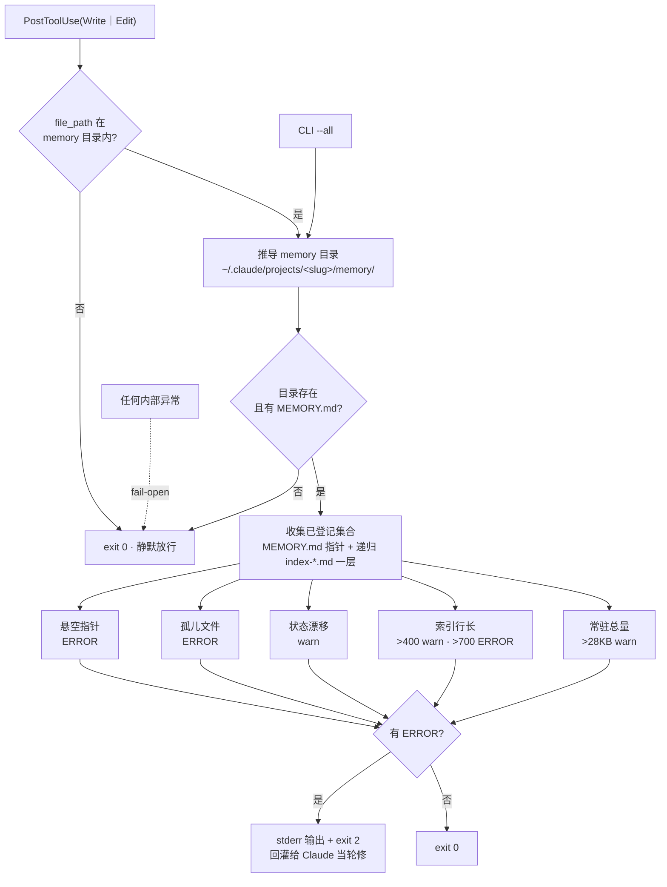

## Context

`claudemd-lint` 守住了 `CLAUDE.md` 这个常驻载体，但 `~/.claude/projects/<slug>/memory/` 同样常驻（索引部分）却完全没有门禁。二者的差异决定了不能简单复用同一个脚本：

| 维度 | `claudemd-lint` | 本 change 的 `memory-lint` |
|---|---|---|
| 检查对象位置 | 仓库内，随 git 版本化 | `~/.claude/` 下，**不在任何 git 仓库** |
| 加载条件 | 全文常驻（祖先层）/ 触碰子树（子目录层） | **索引常驻 + 正文按需 recall** |
| 写入者 | 人工审定 + `/claudemd-commit` | agent 在会话中自动写入，时机分散 |
| 失效形态 | 内容过期、预算通胀 | **索引与实体脱钩**（悬空 / 孤儿 / 状态漂移） |
| 可用基线 | `git show HEAD:<path>` 拿得到前一版 | **没有 git 基线**，只能做当前快照的自洽检查 |

最后一行是关键约束：memory 目录不受版本控制，`claudemd-lint` 的净增量闸（`--diff-gate` 对比 `git show`）在这里**无法实现**。因此本 change 的预算闸只能是绝对阈值，不能是增量闸。

实测基线（2026-08-28，本机 21 个有 memory 的项目、139 个 projects 目录）：

```
规模分布   amc-afa 24094 B 索引 / 221 实体文件  ← 唯一大项目
           第二名 1738 B / 10 files;其余 < 1 KB;5 个 memory 为空
索引行     n=209  p50=146  p75=187  p90=322  p95=384  p99=503  max=552
缺陷       amc-afa 1 悬空 + 1 孤儿 + 1 状态漂移(同一次重命名的三个面)
```

## Goals / Non-Goals

**Goals**

- 索引与实体文件的双向映射闭合可被机械判定
- 二级索引下沉机制被正确识别，不因它产生误报
- 索引所述状态与正文矛盾时能被发现
- 常驻索引字节量有闸门
- 无 memory 目录的项目零影响、零输出

**Non-Goals**

- **不判断「哪条知识值得记」**——准入判据属 `claudemd-standard §12b`，是软判断，交给人与 `/claudemd-commit`，不由 lint 裁决
- **不做净增量闸**——memory 不在 git 下，没有基线可比（见 Context 表末行）
- **不自动修复**——不代写索引行、不删孤儿文件。lint 只报，修由 Claude 当轮做
- **不回头补 `claudemd-lint` 的测试**——那是独立 change 的范围

## Decisions

### D1 · 独立脚本，与 `claudemd-lint` 零耦合

`memory-lint.py` 不 import `claudemd-lint.py`，两者不共享代码。理由是 Context 表里的五处差异——共享会让两边的阈值、路径域、fail-open 边界互相污染。代价是少量重复（`fmt` 字节格式化、fence 跳过），可接受。

### D2 · 阈值取自实测分布，不拍脑袋

| 闸 | 阈值 | 依据 |
|---|---|---|
| 索引单行 warn | > 400 B | 覆盖实测 top 3%（209 条中 7 条） |
| 索引单行 ERROR | > 700 B | 当前**零触发**（max=552），纯防未来失控 |
| 常驻索引总量 warn | > 28 KB | `amc-afa` 24 KB 是唯一接近者，留 ~15% 余量；超线的正解是下沉二级索引而非删知识 |

**刻意宽于 `CLAUDE.md` 的 200 B / 400 B**：索引行承担坑位前置警告职能——`❗❗MUST 走 pypi:conda matplotlib 拉 numpy 2.5.2 撞 af-abc 的 numpy==2.3.2 pin 直接拒解` 这类摘要放在常驻层是刻意设计，看一眼索引就能避坑、不必 recall 正文。按 `CLAUDE.md` 行长标准压缩等同于摘除防护。

### D3 · 二级索引识别 = `index-*.md` 命名约定，递归一层

判定规则：被 `MEMORY.md` 指向、且文件名以 `index-` 开头的文件视为二级索引，其内部的 `- [标题](文件名.md)` 条目并入「已登记」集合。

**为什么不用「文件内含条目清单」作为判据**：普通 memory 正文里也可能出现 markdown 链接，那会把被链接的文件误计为已登记，造成**漏报孤儿**——门禁漏报比误报更危险。命名约定是零歧义的，且 `amc-afa` 已自发采用该命名。

递归深度限制为一层（`MEMORY.md` → `index-*.md`），并维护 visited 集合防环。二级索引再指向三级索引的情况当前不存在，若出现按孤儿报出，由人决定是否扩展。

### D4 · 状态漂移用有序阶段表比对，且只读 frontmatter `description`

从索引行文本与被指向文件的 frontmatter `description` 各提取一个「最高阶段序号」，索引侧显著落后于正文侧时报 warn：

```
1 propose   已 propose / 未 apply / 待 apply
2 apply     已 apply / apply 完 / N/N 完成
3 mr        待开 MR / 已开 MR / MR !\d+ / 待 PR
4 merged    已合 main / 已合并 / 已 merge
5 deployed  已部署 / 已上线 / 已发 eks / 已发版
```

**只读 `description` 这一行、不扫正文全文**——正文常回顾历史阶段（「此前 propose 时……」），全文扫描必然误报。`description` 是 frontmatter 里的单行当前态摘要，语义边界干净。

判为 **warn 而非 ERROR**：自然语言比对不可能完全可判定，硬拦会产生不可消除的误报。这条闸的价值是「提示人来看一眼」，不是「机械阻断」。

### D5 · slug 推导只做正向

`绝对路径 → slug` 是 `str.replace("/", "-")`，确定性成立（已对 139 个目录、两例逐字符验证）。**反向不可逆**——项目名自带 `-` 时（`intent-driven-claude-code`、`amc-afa`）无法还原路径分隔符。脚本只需正向，故不实现反向。

### D6 · fail-open 是硬约束

任何内部异常（JSON 解析失败、编码错误、权限不足、路径异常）一律 `return 0` 静默放行。沿用 `claudemd-lint` 的原则：**坏门禁不能锁死编辑**。这条在 spec 里有独立 Scenario 钉住。

### D7 · 测试落仓库根 `tests/`，不进 `template/`

`install.sh` 是无排除的全量 `copy_tree`（`find . \( -type d -o -type f \)`），放在 `template/` 下的任何文件都会被分发进用户项目。测试是本仓库的自用资产，故落 `tests/test_memory_lint.py`，用 `importlib.util.spec_from_file_location` 跨目录加载被测脚本（文件名带 `-`，不能直接 import）。

本仓库当前**零测试文件**，`claudemd-lint.py` 的 467 行也没有测试。本 change 是第一个带测试的，顺带把 `tests/` 这个落点立起来。**门禁脚本尤其需要测试**——它的失效是静默的假绿，而仓库自己的实践记忆里已有多条此类教训。

### 检查流程 · 静态视图

两个入口收敛到同一套检查，五道闸并行判定，只有 ERROR 才回灌 Claude：



同一张图的纯文本版（供无 Mermaid 环境阅读）：

```
                    ┌─ PostToolUse(Write|Edit) ─┐        ┌─ CLI --all ─┐
                    │  payload.file_path        │        │             │
                    └───────────┬───────────────┘        └──────┬──────┘
                                │ 在 memory 目录内?              │
                          否 ─→ exit 0                          │
                                │ 是                            │
                                ▼                               ▼
                    ┌───────────────────────────────────────────────┐
                    │  推导 memory 目录: ~/.claude/projects/         │
                    │    <cwd 绝对路径 / → ->/memory/                │
                    │  不存在 或 无 MEMORY.md ─→ exit 0              │
                    └───────────────────┬───────────────────────────┘
                                        ▼
                    ┌───────────────────────────────────────────────┐
                    │  收集已登记集合                                 │
                    │    MEMORY.md 的 - [](x.md)                     │
                    │    + 递归 index-*.md 一层 (visited 防环)        │
                    └───────────────────┬───────────────────────────┘
                                        ▼
        ┌───────────────┬───────────────┼───────────────┬───────────────┐
        ▼               ▼               ▼               ▼               ▼
   悬空指针         孤儿文件        状态漂移        索引行长        常驻总量
   ERROR           ERROR          warn           >400 warn      >28KB warn
                                                 >700 ERROR
        └───────────────┴───────────────┼───────────────┴───────────────┘
                                        ▼
                          errs? → stderr + exit 2  ·  else exit 0
```

## Risks / Trade-offs

- **状态词表覆盖不全** → 漏报状态漂移。缓解：漏报只是回到今天的状态（今天完全没有这道闸），不制造新问题;表可增量扩充。
- **`index-` 命名约定未被其他项目采用** → 二级索引不被识别，其登记的条目误报为孤儿。缓解：当前只有 `amc-afa` 有二级索引且已用该命名；约定写进 `§12b`，新建二级索引时有据可依。
- **PostToolUse 每次写 memory 都跑一次全目录扫描** → 220 文件量级下是毫秒级（纯 stat + 单文件读），可接受；若未来某项目达到数千文件再谈增量缓存。
- **28 KB 总量线可能对超大项目偏紧** → 它是 warn 不是 ERROR，不阻断；且正解是下沉二级索引（下沉后一级索引变小），不是删知识。

## Migration Plan

无数据迁移。脚本上线后：

1. 现有项目首次触发时可能报出存量问题（`amc-afa` 的三处已在立项调研中手工修复，当前应为零 ERROR）
2. 无 memory 目录的 118 个项目、memory 为空的 5 个项目：零输出、零影响
3. `hooks.json` 的合并由 `install.sh` 幂等处理（按 command 去重），已有用户重跑 install 即获得该门禁

## Open Questions

- **28 KB 总量线是否需要按实体文件数缩放**（如 `120 B × 文件数`）？当前样本只有 `amc-afa` 一个大项目（109 B/file），单点无法定标度律，故先用绝对值。待第二个大项目出现后再评估。
- **是否该给 `claudemd-lint` 补测试**？本 change 立了 `tests/` 落点但不回头补——建议作为独立 change。
