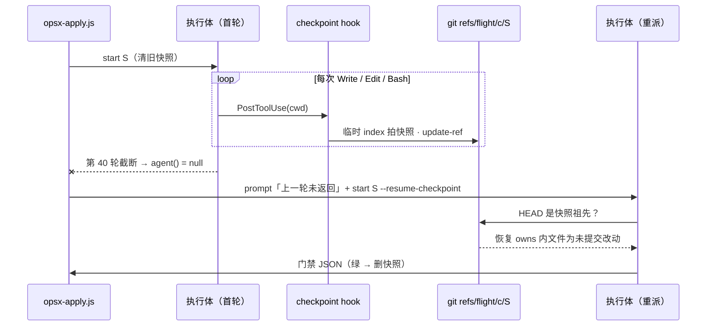

# 设计 · 执行体未返回：快照接续 + 重派一次

**触发器命中**：跨模块（hooks / workflow / agents / commands / skills / settings）+ 新契约（`refs/flight/` 引用命名空间、`start --resume-checkpoint`、新 hook 注册）→ 写实质设计。图示约定沿用本仓既有 design：plain Mermaid、轻量 C4（动态图），未单独向用户确认格式。

## Context

现状链路（`opsx-apply.js`）：

```
agent(executorPrompt(s)) ──r──▶ r && !r.ok ? agent(executorPrompt(s, r)) : r
                                  │
                                  └─ r 为 null（撞 maxTurns / API 死亡）→ 不进重派分支 → blocked{infra, "agent 未返回"} → 依赖它的切片连带 blocked
```

- 128 次飞行里 56 个执行体未返回，52 个停在第 40 轮中途（`stop_reason: tool_use`）。35 次飞行因此 blocked，连带 58 个下游切片。
- 半成品状态：40 / 56 从未 commit；37 / 56 跑在 Workflow 临时 worktree（`isolation: worktree`），脚本拿不到它的路径与 sha；Workflow `agent()` 没有复用 worktree 的选项（2026-09 已核实）。
- 官方文档（code.claude.com/docs/en/hooks · sub-agents · workflows，2026-10-08 核实）：子 agent 内的 PostToolUse 输入带 `agent_id` / `agent_type`；`additionalContext` 可注入；**没有任何字段暴露当前轮次**；`maxTurns` 按 API 往返计；`agent()` 在 API 死亡时解析为 null，撞 maxTurns 的解析值文档未写（本机实测为 null）。
- 已在跑的 hook（`test-evidence.py`、`stop-gate.py`）证明：hook 会在 Workflow 子 agent 内触发，payload 的 `cwd` 指向该 agent 的 worktree，可靠 `.openspec-slice` 标记定位切片。

在役 ADR：`DRAFT-apply-as-flight`（调度用确定性脚本、门禁 JSON 决定重试一次或 blocked、评判用机械门禁）与 `DRAFT-gate-evidence-not-self-reported`（真值源只认转录 / 文件系统 / git / hook 留痕；hook 自身异常 fail-open）。本设计的快照落在 git、由 hook 产生、恢复由脚本判定，与两者一致。

## Goals / Non-Goals

**Goals**
- 执行体被截断或死亡时，owns 内的半成品（含未提交、未跟踪文件）留在可按名字找到的地方。
- 未返回与门禁红共用一次重派预算；重派在隔离 / 不隔离两种模式下都能接着半成品继续。
- 恢复判据全部是脚本与 git 事实，模型不参与判定。

**Non-Goals**
- 不改 `maxTurns: 40`，不做按轮次提前收尾（无可靠轮次来源）。
- 不改门禁红重试的 cherry-pick 路径（`slice-retry-resume`）。
- 不覆盖 fix 阶段（历史 0 次未返回）。
- 不做跨飞行接续（用户裁决）。

## Decisions

### D1 快照由 hook 机械产生，不靠执行体自觉

| 候选 | 判断 |
|---|---|
| 执行体纪律里要求"频繁 WIP commit" | 模型自觉，违反铁律 9；且多 commit 打破"每切片一个 commit"，评审 `git show <commit>` 只看到最后一个 |
| 轮次预算 hook 注入"立即收尾" | 无轮次字段，只能数工具调用，一轮并行多调用会偏早收尾；API 死亡覆盖不到 |
| **PostToolUse hook 每次 Write / Edit / Bash 后快照** | 零 token；与死亡原因无关；最后一次工具调用在撞上限前已执行，其 PostToolUse 照常触发。选它 |

注册：`PostToolUse` matcher `Write|Edit|Bash` + `PostToolUseFailure` matcher `Bash`（失败的 Bash 也可能已改文件，例如格式化器报错）。实现为 `slice-gate.py checkpoint` 子命令而非新脚本：复用 `glob_match` / owns / 标记读取，判据只有一份。

### D2 快照存为 git 引用 `refs/flight/<change>/<S>`

| 候选 | 判断 |
|---|---|
| `git stash create` | 不含未跟踪文件（新建的测试与源码正是半成品主体）；stash 栈全仓共享，会与其他会话互相踩 |
| 复制文件到 change 目录 | 落进工作区，污染 G6 / 飞行记录，合回时冲突 |
| **临时 index 拍 commit + `update-ref`** | 引用在所有 worktree 间共享（`refs/flight/` 不是 per-worktree 命名空间），按切片名确定性可找，不需猜路径；不碰真实 index / HEAD / 工作区。选它 |

拍法（`GIT_INDEX_FILE` 指向本进程独占的临时文件）：`read-tree HEAD` → `add -A -- <owns 内改动文件>` → `write-tree` → `commit-tree <tree> -p HEAD -m "flight checkpoint <S>"` → `update-ref refs/flight/<change>/<S> <sha>`。文件集合 = `git status --porcelain -uall` 的路径 ∩ owns，排除标记文件与 change 目录（飞行记录）。没有 owns 内改动且 HEAD 等于标记 base 时不写引用。并行工具调用产生的并发快照各用自己的临时 index，`update-ref` 原子，后写者赢，内容只差一次工具调用。

### D3 恢复为未提交改动，不重放 commit

`start <S> --resume-checkpoint` 在没有同片标记时：引用存在且 `merge-base --is-ancestor HEAD <snap>` 成立 → 对 `diff --name-only HEAD <snap>` ∩ owns 的文件，快照中存在的 `git checkout <snap> -- <f>`，快照中不存在的从工作区删除；HEAD 不动，标记 base = HEAD。半成品里执行体自己做过的 commit 被压平成未提交改动，切片收尾仍是一个 commit。

| 候选 | 判断 |
|---|---|
| `cherry-pick base..snap` 重放 | 快照 commit 本身是"WIP"，重放会留下多个 commit；还要额外 squash |
| **checkout 文件压平** | 与"每切片一个 commit"天然一致；门禁 `changed_files` 对已暂存 / 未暂存一视同仁。选它 |

基点不符（HEAD 不是快照祖先）时不恢复：同一 wave 内重派时 change 分支 tip 不会动（integrator 在 `await parallel` 之后才合回），正常路径必然满足；不满足说明快照来自别的历史，宁可从头做。

### D4 生命周期：首轮清、绿删、红留

- 写新标记的 `start`（不带 `--resume-checkpoint`）先 `update-ref -d` 本切片旧快照 → 重派能用到的快照只来自本次飞行首轮（用户裁决：不跨飞行）。
- `gate` 绿删引用；红保留（门禁红的重派走 cherry-pick，不用快照；保留只为人工排查）。
- 已有同片标记的 `start`（resume 分支）不动引用。

### D5 工作流：null 与红共用一次重派

```js
const NO_RETURN = { noReturn: true }
// .then((r) => (!r || !r.ok) ? agent(executorPrompt(s, r || NO_RETURN), {label: `${s}:retry`, ...}) : r)
// executorPrompt：retryOf.noReturn → 不 cherry-pick；startCmd(s, null, true) 追加 --resume-checkpoint；任务行说明上一轮未返回、看 checkpoint.restored、在半成品上继续
// 结果仍为 null → blocked {slice, kind: 'infra', reason: 'agent 未返回（已重派一次）'}
```



Agent 回退路径语义一致（铁律 10）：执行体回报里没有门禁 JSON（Agent 工具标记 partial 或无 JSON）→ 同样重派一次、`start` 带 `--resume-checkpoint`；不改用 SendMessage 续跑原 agent，以免两条路径的重派语义分叉。

## Risks / Trade-offs

- [hook 让每次工具调用多一次 python 启动] → 无标记时只做一次 `git rev-parse --show-toplevel` 即退出；有标记时 5 条 git plumbing 命令。与已注册的 `test-evidence.py`、`claudemd-lint.py` 同量级。
- [hook 内部异常] → 整个子命令包 try，异常一律静默 exit 0（ADR gate-evidence：hook 自身异常 fail-open）；最坏退化为今天的行为。
- [owns 外的改动不进快照] → 门禁本就 G6 拒绝 owns 外改动；不快照它们是一致的。
- [`.gitignore` 命中的 owns 文件不进快照] → 执行体本来也提交不了它们，一致。
- [快照引用残留（blocked 切片）] → 下次首轮 `start` 会清；不 push，不进远端。
- [重派仍可能再撞上限] → 每片只重派一次，第二次未返回照旧 blocked，但半成品已累积在快照里供人工接手。
- [`agent_id` 等字段未被使用] → 有意不依赖：快照只看标记，主会话在 change worktree 里触发也无害（只是多拍一张）。

## Migration Plan

- 下游：`install.sh` 按 command 元组幂等合并 `hooks.json`，`--upgrade` 后新 hook 自动注入 `.claude/settings.json`；不升级则一切行为同今天（工作流重派会带 `--resume-checkpoint`，旧 `slice-gate.py` 不认此参数——升级是整包替换 hooks 与 workflows，不会出现新工作流配旧脚本）。
- 本仓 dogfood：根 `.claude/settings.json` 同步注册（指向 `template/.claude/hooks/slice-gate.py`）。
- 回滚：删两条 hook 注册即停止快照；工作流对 null 的重派仍可工作（无快照 → `checkpoint.restored` 为空，从头做）。
- 度量：合入后用同一套转录脚本（本会话 scratchpad `hist_noreturn.py` / `hist_cap_impact.py`）对比未返回后的重派成功率与连带 blocked 数；无数据不称改善（铁律 8）。

## Open Questions

- `DRAFT-apply-as-flight` 的 Consequences 写有"执行体受 maxTurns 与所有权双重约束，超预算即 blocked"。本 change 后超预算先重派一次。这是后果描述而非决策条款，本设计**不提议 supersede**；若你认为需要，adr 步骤可补一条 superseding ADR。
- 若合入后仍见大量"重派后仍未返回"，再评估按轮次预算提前收尾（需官方暴露轮次字段或可靠近似）或切片规模 lint。
