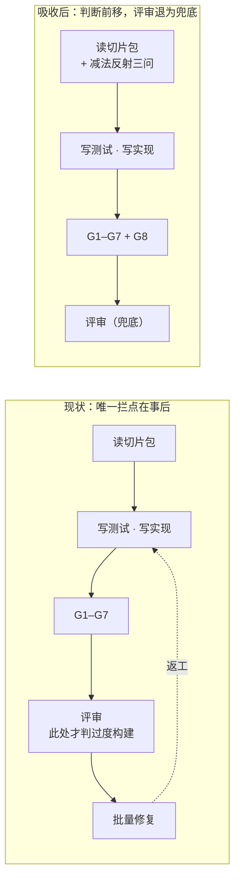

# 设计 · 实现段的减法反射与 ceiling 判据

**触发器命中**：改公共契约（`slice-gate.py gate` 的 `failed` 取值域新增 `G8`、`gate-report.md` 新增一个表、两个 agent 的行为契约）+ 跨模块（hooks / agents / tests）→ 写实质设计。

## Context

外部 prompt 工程产物（`DietrichGebert/ponytail`，@ `356918e`）把「AI 默认过度构建」这个真问题压成了一个 120 行的常驻人格。审查结论（judged by 本仓库 11 条铁律）：**症状端强、机制端弱**——它的规则没有一个执行器，三个 hook 全是注入与状态标记，CI 守的是 8 份规则副本一致性而非技能有效性。

本仓库的情况正相反：机制端强（G1–G7 + intent-gate + takeoff-gate + stop-gate），但**实现段缺一个减法反射**。`code-reviewer.md` 的 checklist 已经能判「重复代码」与「未要求的抽象（YAGNI）」，缺的不是判据而是**时点**：



第三个缺口是载体：故意切了角的简化（全局锁、O(n²) 扫描、朴素启发式），其理由在本体系里无处可落——ADR 太重（长期架构承诺），`gate-report.md` 只记门禁结论，对话会被 compact。ponytail 有这个规范（`ponytail:` 注释标注 ceiling 与升级路径）但零执行器，纯自愿。

## Goals / Non-Goals

**Goals:**

- 把「先搜已有 / 根因修复 / 简化留天花板」三条纪律放进**实现段**（执行体开工那一轮），不放进常驻记忆。
- 让第三条有机械执行器：标了就必须标全，格式由脚本判定，零 token。
- 让这些简化决策**可汇总、可回看**：合规标记进 `gate-report.md`，与门禁结论同一份记录。
- 吸收与拒绝的判据本身留档（ADR），使下一次"要不要装某个外部 prompt 产品"有可复用的闸门。

**Non-Goals:**

- **不判"该不该标"**。G8 只校验既有标记的完整性；"这里切了角却没标"是语义判断，留给 `code-reviewer`（其维度一条不减）。
- **不引入任何 LOC / diff 行数阈值**。见 proposal 的拒绝表：LOC 分不清压缩与简化。
- **不常驻**。`template/CLAUDE.md.snippet` 与仓库根 `CLAUDE.md` 均不加条目（D5）。
- **不改 G1–G7 语义**，不进 `cmd_final`（D7）。
- 不吸收 ponytail 的测试 YAGNI、删解释、ultra 挑战需求、常驻人格四条（proposal 已列，ADR 定档）。

## Decisions

### D1 吸收闸门：用它自己 ladder 的前三级审这份规划

六个候选各过三问，结论与证据：

| 候选 | Q1 真缺口？ | Q2 已有覆盖？ | Q3 能机械判？ | 裁决 |
|---|---|---|---|---|
| 先搜已有再写 | 是（执行体纪律段无此条） | 评审事后有，事前无 | 否（语义） | **吸收 · 提示层** |
| 根因修复 · grep 全部 caller | 是（两侧都无） | 无 | 否（语义） | **吸收 · 提示 + 评审** |
| 简化留天花板 | 是（代码级无载体） | 无 | **是**（正则） | **吸收 · 机械 G8** |
| 依赖新增门禁 | — | **有**：`owns` 白名单 → G6 拒绝；且"引入新依赖"本就是 `snippet` 里的中级+ 触发条件 → `intent-gate` 拦 | — | 砍 |
| reuse 专用 `PreToolUse` hook（替模型预搜） | **否**：评审层尚未报过一次重复实现 | — | — | 砍（观察判据见 Open Questions） |
| diff 行数 / LOC 阈值 | **否**：要解决的是结构问题，不是长度问题 | — | 是（但判错的事） | 永久拒绝 |

采纳这套闸门本身的理由：它把"看起来有用"与"经证据确认缺失"分开。上表第 4 行是直接收益——最初的规划建议做依赖门禁，读了 `owns` 机制后发现已被两层覆盖。

### D2 标记语法：`ceiling:` + `->`，不沿用外部品牌名

| 候选 | 判断 |
|---|---|
| 沿用 `ponytail:` | 否。仓库内出现外部产品名会让读者以为装了那个插件；且语义偏了——我们要记的是**天花板**，不是"这里很懒" |
| 中文 `# 天花板:` | 否。注释符前缀在不同语言下已需多态匹配，再叠中英混排会让正则更脆；`grep` 跨平台也更麻烦 |
| **`ceiling:` + `->` 分隔（采用）** | ASCII、语义准、`grep -rn 'ceiling:'` 直接可用；`->` 与 `→` 都接受（中文输入法常出全角箭头） |

契约形状（两段都必须非空，去空白后各 ≥ 4 字符）：

```
<注释符> ceiling: <限制> -> <升级条件或路径>
```

### D3 扫描范围三重收窄 —— 自举陷阱是真实的

G8 的实现文件自己会提到 `ceiling:`。若判据按「行内含 `ceiling:`」匹配，S1 提交 `slice-gate.py` 的那一刻 G8 就会扫到自己的正则常量与说明注释并判格式不合。三重收窄：

1. **只扫 diff 新增行**（`git diff <base>..HEAD` 的 `+` 行），不扫全文件；行号由 hunk header 累加得出。
2. **只扫源码**：复用既有 `is_doc_or_config()` 与 `NON_SOURCE_PREFIX`（`.claude/` · `openspec/` · `docs/`）排除文档与配置——切片包里写示例不会自触发。
3. **只匹配行首注释紧跟标记**：`^\s*(?:#|//|--|\*)+\s*ceiling:`。`CEILING_RE = re.compile(...)` 这类代码行不匹配；说明注释写成 `# G8 ceiling: …` 也不匹配（`ceiling:` 不紧跟注释符）。

⚠ 实现 `slice-gate.py` 时**不得写出 `# ceiling: …` 形状的说明注释**；要举例就写 `# G8 ceiling: …` 或放进 docstring 的非行首位置。S1 切片包记了这条，并要求一条针对性的自举测试。

### D4 严厉度：`failed` 阻断，不是 `warnings`

| 候选 | 判断 |
|---|---|
| `warnings` 观察一轮 | 否。警告在本体系里不阻断收口，等于又回到"自愿标注"——正是 ponytail 那条规范失效的原因 |
| **`failed` 阻断（采用）** | 标注成本极低（一行注释写全两段），而 SC4 保证「不标不红」，所以执行体永远有一条零成本的合规路径：要么不标，要么标全。**不存在"被迫写空洞标记"的压力** |

安全阀是 SC4 这条非目标守卫测试：它锁死"无标记的切片必须绿"，使 G8 无法演化成"每切片都得标"的形式主义判据。

### D5 只在实现段生效，不进常驻记忆

减法纪律写进 `slice-executor.md`（执行体每次开工必读的 39 行契约），**不写进** `template/CLAUDE.md.snippet` 与仓库根 `CLAUDE.md`。三个理由：

1. **阶段性**：「该少写」与「该写全」在项目里交替出现；常驻会让它在一半时刻是错的。ponytail 的 `no drift` 条款正是把阶段切换当故障，这是它的反向机制之一。
2. **辖区**：按 `claudemd-standard` 的准入四问，第 ④ 问「能写成测试 / lint / hook 吗」答「能」→ 去写那个。G8 就是那个。
3. **预算**：`snippet` 受 `tests/test_docs_iron_rules.py::test_claudemd_iron_rules` 的 8KB 硬断言约束，当前已接近上限；花在此处不值。

### D6 汇总落 `gate-report.md`，不新立文件

合规标记汇总进 `gate-report.md` 的「## 天花板」表（`| 时间 | 切片 | 位置 | 限制 | 升级路径 |`），追加式，不动既有 Gate Report 表。复用现成的 `append_report()` 写入路径，零新文件、零新读取方——飞行记录已经是收口要打印的东西，天花板跟它同处一份最省。

### D7 只在 `gate` 子命令，不进 `cmd_final`

`ceiling` 是逐切片的代码事实，收口再全量扫一遍只会把同样的行重复报一次。`cmd_final` 保持现状（全量 verify + G7 scenario 对账）。

### D8 新判据必须带 good / bad fixture 对（反向吸收它的方法学）

ponytail 最硬的一点是**先证尺子再花钱**：`benchmarks/agentic/run.py --selftest` 必须先证明 scorer 能区分 good / bad 参考实现，才允许消费 API；`--rescore` 让改指标不重复付费。对应到本仓库 = **每条新门禁判据必须成对断言**：合规样本必过（SC1）、每种违规样本必被抓且点名位置（SC2 / SC3）、非目标必须守住（SC4）。`tests/` 已经是这个形状（`test_gate_pass_json` 与 `test_gate_ownership_violation` 成对），本 change 把它写成 spec 约束而不是习惯。

## Risks / Trade-offs

| 风险 | 处置 |
|---|---|
| **形式主义标注**：执行体为过门禁写空洞 ceiling | SC4 保证不标不红 → 合规成本为零的路径永远存在；且 G8 只校验格式完整性，写空洞两段仍会被 `code-reviewer` 的可维护性维度看见 |
| **正则误伤 / 自举自触发** | D3 三重收窄 + S1 要求一条针对性自举测试（提交含 `ceiling:` 字样的实现文件时 G8 不得因自身代码变红） |
| **G8 管不到"该标却没标"** | 承认边界：这是语义判断，留给评审。G8 的价值是把"已经想到要标的人"从自愿变成必须标全 |
| **agent 契约测试断言中文短语**，改措辞即红 | 既有模式如此（`test_executor_agent_contract` 已断言「一轮多动作」等），接受；改措辞时同步改断言是正确的耦合 |
| 执行体可能干脆不标以避开 G8 | 无法机械阻止（同上一条）。缓解：`slice-executor.md` 的纪律行把"切了真角要标"写成开工契约，评审兜底 |

## Migration Plan

- 无数据迁移、无配置迁移。`hooks.json` 不变（G8 在 `slice-gate.py` 内部，不新增 hook 注册点）。
- **回退**：G8 实现为独立函数 + `cmd_gate` 里一行调用。删那一行即回到 G1–G7 语义，`gate-report.md` 的「天花板」表留在历史记录里不影响解析（追加式）。符合铁律 10「回退路径语义一致」。
- 下游影响：`install.sh` 分发面不变（同一份 `slice-gate.py`）；已安装的用户项目升级后，旧 change 的 `gate-report.md` 不含天花板表，新表按需创建。

## Open Questions

1. **先搜已有是否需要机械执行器**：本次只做提示层。观察判据——连续 3 个切片被 `code-reviewer` 报「重复实现」，则立 change 做 `PreToolUse` 预搜注入（替模型搜好摆在面前，而不是要求它自述搜过了；自述违反"判据禁自证"）。
2. **`phase-gate.py` 悬空注册**（旁枝，不在本 change 范围）：主仓 `.claude/settings.json:7` 注册了 `template/.claude/hooks/phase-gate.py`，该文件在 main 上不存在，`template/.claude/hooks/hooks.json` 也无此条，hooks 目录里找不到任何 explore 阶段闸门实现。注册包了存在性保护故静默放行、无害，但 PR #30 标题里的「explore 阶段闸门」在 main 上没有落地物。建议单开 change 查清是"未落地"还是"落在别处"。
3. **`openspec instructions` 的 schema 告警**（旁枝）：本仓 schema `intent-driven` 的 rules 里引用了不存在的 artifact id `spec`（有效值为 adr / design / proposal / specs / tasks），每次 `openspec instructions` 都会打一行 `Unknown artifact ID in rules: "spec"`。不影响工件生成，但属噪音，可并入下次 schema 维护。
4. **in-force ADR 是否需要 supersede**：`DRAFT-gate-evidence-not-self-reported`（门禁判据不得由被门禁方提供）与本 change 同向，本 ADR 是其在"外部能力吸收"方向上的补充，**不 supersede**，只在关联里互指。
